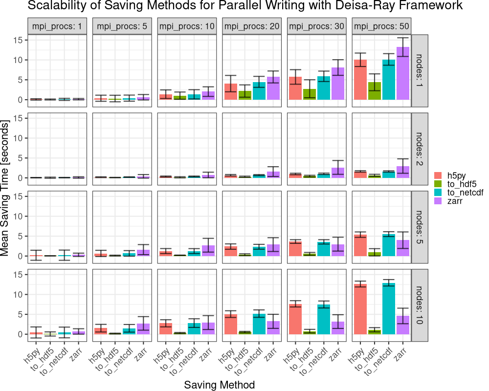
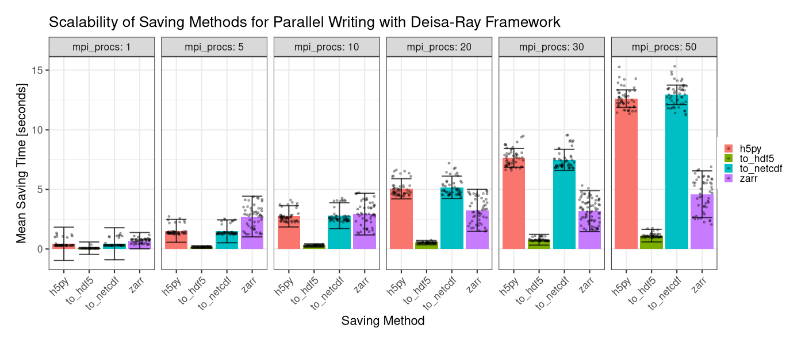
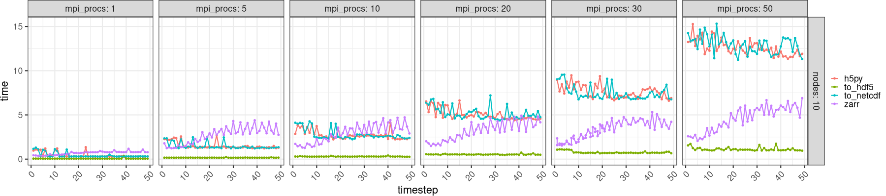
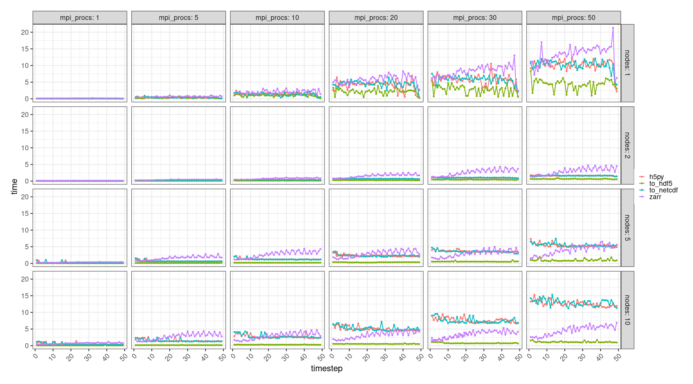

# Integration and Benchmarking of Parallel Writing for Deisa-Ray

1.  [Exploration Phase](#orgd11df71)
2.  [Solution for HDF5: Virtual Datasets](#org3309fc2)
3.  [Benchmarking and Performance Analysis](#orgb405874)
4.  [Conclusion](#orgac25ff2)

This report details the progress, challenges, and architectural
solutions developed to enable efficient parallel writing of
distributed Dask arrays within the `deisa-ray` framework.  The primary
focus was overcoming the native limitations of dask library when
interacting with parallel file systems.

# Exploration Phase

The project started at [deisa-ray commit dc115a8](https://github.com/deisa-project/deisa-ray/tree/dc115a8648aaee70636a096c61ccf19767771cd4), the first steps
consisted in get used to the project technologies such as Dask and
Ray. Get familiar with [Grid5000](https://www.grid5000.fr/w/Grid5000:Home) was also required for experiments
related to deisa-ray. After feeling comfortable with the project
technologies the focus shifted toward understanding Parallel HDF5 and
the try to integrating it with Dask through [h5py](https://docs.h5py.org/en/stable/index.html) HDF5 python
interface.

Dask has saving functions capable of writing to HDF5 as detailed in
its [documentation](https://docs.dask.org/en/latest/generated/dask.array.to_hdf5.html). However, this functions are not compatible with
distributed environment, which looks like a old well-know dask problem
as show by this issues in dask github repository:
<https://github.com/dask/dask/issues/3074> and
<https://github.com/dask/dask/issues/2488>.

The problem was mainly related to pickling issues with h5py
objects. This problem not only happened with the dask distributed
scheduler, but also with the `dask_on_ray` Ray scheduler. As the hdf5
functionalities did not worked, the main workaround highlighted by the
dask community was to use [Zarr](https://zarr.readthedocs.io/en/stable/) instead of HDF5.

# Solution for HDF5: Virtual Datasets

While the use of Zarr was possible and a wrapper for saving
DeisaArrays with dask was created, there still the need to save to
HDF5. Therefore, to bypass the pickling limitations, a decentralized
"file-per-chunk" strategy was designed using HDF5 Virtual Datasets
(VDS). In this strategy, instead of sending open HDF5 file objects
across the network, independent tasks were dispatched to open, write,
and close separate files for each array chunk. These isolated chunk
files are subsequently merged into a single logical entity using the
VDS capabilities. This approach, also used for zarr storage, achieved
parallel I/O without the need for object serialization or locking.

A [Pull Request was then opened](https://github.com/deisa-project/deisa-ray/pull/67#issue-3886559798) to deisa-ray with initial
implementation of HDF5 saving with this approach.

# Benchmarking and Performance Analysis

As the performance is a important factor for deisa, experiments were
made to evaluate the scalability of the proposed approach. The
experiments consisted in the execution of a simulation based on the
`Gray–Scott model` in python during 50 iterations with a chunk size of
1024x1024. The application was integrated with deisa-ray and executed
across different parallelism levels. The deisa integration defined a
callback that writes the `U` simulation array to a file at each
timestep. Beside our proposed approach of writing to HDF5 with virtual
datasets, three others saving methods were tested, therefore we can
compare our approach to standard methods. The methods used to save are
as follow. Only using the `h5py` library to save data to HDF5 file,
hence saving data sequentially and demanding data movement. Using
`dask.to_zarr` function to save the data to a local zarr
storage. Lastly, transforming the dask array into a xarray DataArray
and saving to the NetCDF file format with the `to_netcdf` function. The
simulation was executed using 1, 2, 5 and 10 nodes from the `paradoxe`
cluster of the [Grid'5000 Rennes](https://www.grid5000.fr/w/Rennes:Hardware) site. We also varied the number of MPI
process for each node, the values used where 1, 5, 10, 20, 30
and 50. With this configuration the case with the least amount of
parallelism was the execution of the application with 1 MPI process in
1 node, and the most extreme was the case with 10 nodes and 50 MPI
processes in each, with a total of 500 MPI processes. The figure
bellow show the results for the experiments. The mean time for saving
in seconds (Y axis) is show in function of the saving method (X
axis). The mean results don't consider the first execution due to
initialisation overhead. The figure is also faceted by number of nodes
and MPI process. The errors bars expresses the standard error with a
CI of 99% for each saving method. The approach with HDF5 VDS is
labelled as `to_hdf5`

This first figure lead us to some interesting insights. First it is
possible to see that using only the `h5py` library is not a scalable
choice. It is was also possible to see that the xarray method
`to_netcdf` showed similar results as the `h5py` method. This behaviour
can be explained by the xarray method being a lockable method, meaning
that two process can not write at the same file. Other factors can
also be related to this behaviour, such as the need to convert the
data format. The proposed saving method with HDF5 VDS showed a great
scalability overall, being fast than the other methods in all
cases. `zarr` show an strange behaviour, with the saving time constantly
increasing during approximately the first 25 timesteps. The image
bellow shows only the case with ten nodes, the black dots
represents the saving times observed.

We can see that while `to_hdf5` showed a consistent saving time
regardless of the number of MPI processes, the same did not apply to
the other methods. The `zarr` observations are the more spread along the
bar. To have a better understand of the simulation behaviour, we can
look at the saving time as a function of the simulation timestep.

We can see here how the methods performed during the simulation. The
`zarr` method as stated has it time constantly increasing at the start
of the simulation, the increasing stops after approximately 20 to 30
iteration, but the saving time remains with a high variance from one
time step to the other. The `to_netcdf` and `h5py` methods also showed
high variances for this high parallelism scenario. The others
parallelism scenarios are show in the figure bellow.

# Conclusion

The implementation of the HDF5 Virtual Datasets (VDS) strategy within
the deisa-ray framework proves to be an effective solution for
overcoming the serialization and locking limitations in the Dask
ecosystem. Benchmarks conducted on the paradoxe cluster demonstrate
that while traditional methods like `h5py` and `to_netcdf` failed to
scale, and zarr exhibited significant temporal instability during
initial timesteps for the tested benchmark, the VDS approach maintains
low and predictable I/O overhead even under high parallelism
scenarios. Ultimately, this decentralized "file-per-chunk" approach
not only enables high-performance parallel HDF5 writing but also
ensures consistent scalability for large-scale simulations with
Deisa. With the success of this implementation for Deisa framework, a
[pull request was opened](https://github.com/dask/dask/pull/12309) in the dask GitHub repository trying to
integrate the approach used for deisa for dask as well.
