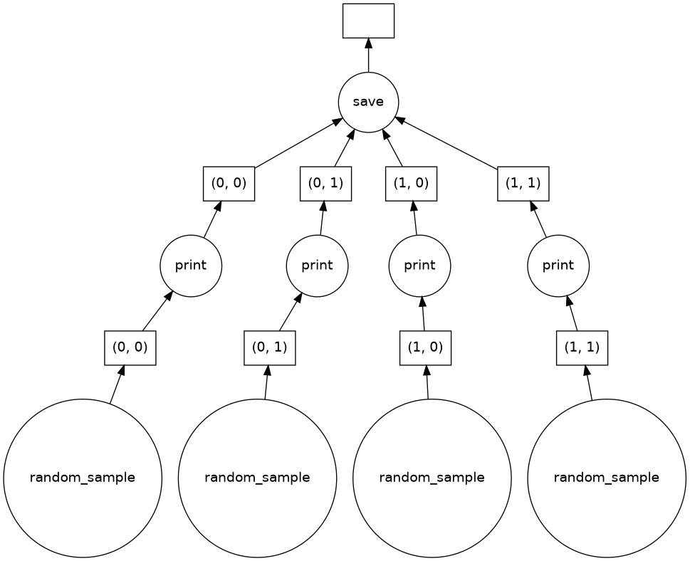

#+STARTUP: content
#+STARTUP: overview
#+STARTUP: indent
#+TITLE: Lab notes
#+AUTHOR: Rayan Raddatz de Matos
#+PROPERTY: HEADER-ARGS+ :eval no-export
#+auto_tangle: t

* TODOS

** TODO See about scotch and how it can be used

** IN-PROGRESS Keep track of PR in dask
- State "IN-PROGRESS" from              [2026-02-27 Fri 16:16]

** TODO Create a report about what was done with hdf5

* DONES
** DONE Rewrite to a manner similar to dask, saving multiple arrays at a time
CLOSED: [2026-02-27 Fri 16:15]
- State "DONE"       from "TODO"       [2026-02-27 Fri 16:15]
Also see about multiple timesteps for a analytics...

[16:15:26; 27.02.2026]: This can be done by creating diferent datasets

** DONE See how the writing is performing in a parallel environment
CLOSED: [2026-02-27 Fri 16:14]

- State "IN-PROGRESS" from "DONE"       [2026-02-27 Fri 16:14]
- State "DONE"       from "TODO"       [2026-02-27 Fri 16:14]
[15:43:31; 11.02.2026]: The results that I get at the moment are not
very good...

[11:59:24; 23.02.2026]: it is good to be honest! I run with up to 50
nodes and everything was ok!

** DONE Create manually a dask graph that saves to a hdf5 file.
CLOSED: [2026-02-04 Wed 15:12]

- State "DONE"       from "TODO"       [2026-02-04 Wed 15:12]
** DONE Read about the task internals of dask.
CLOSED: [2026-02-04 Wed 15:12]

- State "DONE"       from "TODO"       [2026-02-04 Wed 15:12]
** DONE Read and understand how the deisa tests are structured, then creating a dask.to_zarr test
CLOSED: [2026-01-28 Wed 16:20]

- State "DONE"       from "TODO"       [2026-01-28 Wed 16:20]
[15:14:36; 27.01.2026]: See the analytics tests.

[16:20:25; 28.01.2026]: I made a test to it that is working, I need
after to talk with andres or hugo about this.

** DONE Try to play with dask and create some analytics based on the Bruno class examples
CLOSED: [2026-01-27 Tue 15:12]
- State "DONE"       from "IN-PROGRESS" [2026-01-27 Tue 15:12]
- State "IN-PROGRESS" from "TODO"       [2026-01-22 Thu 10:23]

[10:22:49; 22.01.2026]: Yesterday I asked Bruno if he has some
examples to me to play around or if I use the one from his slides.

** DONE Read about HDF5
CLOSED: [2026-01-27 Tue 15:12]
- State "DONE"       from "TODO"       [2026-01-27 Tue 15:12]
See the integration with dask, how to use in parallel.

See about zarr also.

[15:13:02; 27.01.2026]: Looks like hdf5 don't have a good support by
dask, but zarr does. I will try to create a deisa test with zarr tomorrow.

* R recurrent functions
** Read data from HDF5 exp

#+begin_src R :results output :session *R* :exports both

meu_estilo <- function() {
    list(
        theme_bw(base_size = 22),
        theme(
            legend.title = element_blank(),
            plot.margin = unit(c(0, 0, 0, 0), "cm"),
            legend.spacing = unit(1, "mm"),
            legend.position = "right",
            legend.justification = "left",
            legend.box.spacing = unit(0, "pt"),
            legend.box.margin = margin(0, 0, 0, 0),
            axis.text.x = element_text(angle=45, vjust=1, hjust=1)
        ))
}

load <- function(dir="./BENCHMARKS/results", regex="s\\/results.csv") {

  options(crayon.enabled=FALSE)
  suppressMessages(library(fs))
  suppressMessages(library(tidyverse))

  BASE <- dir
  tibble(CSV = dir_ls(BASE, regexp = regex, recurse=TRUE)) |> print() |>
    mutate(DATA = map(CSV, read_csv, show_col_types=FALSE, progress=FALSE)) |>
    unnest(DATA)|> select(-CSV, -type) |>
    select(type=type2, everything())
}

stats <- function(df) {

  df |> group_by(type, cores) |>
  summarise(N=n(),
            mean_time = mean(time),
            sd_t = sd(time),
            se = 3*sd_t / sqrt(mean_time)
            ) |>
    arrange(cores)
}

line_g <- function(df) {

suppressMessages(library(ggplot2))

  df |> ggplot(aes(color=type,x=cores, y=mean_time)) +
    geom_point(size=5) +
    geom_line(size=3, alpha=0.2) +
    meu_estilo()

}

line_g_err <- function(df) {

suppressMessages(library(ggplot2))

  df |> ggplot(aes(color=type,x=cores, y=mean_time,
                   ymin = mean_time - se,
                   ymax = mean_time + se # [10:53:57; 12.02.2026]:  uncomment for variance
                   )) +
    geom_point(size=5) +
    geom_line(size=3, alpha=0.2) +
    geom_errorbar(width=.8, alpha=.7, position="dodge") +
    meu_estilo()

}

col_g_sd <- function(df) {
  suppressMessages(library(ggplot2))

  df |> ggplot(aes(fill=type, x=type, y=mean_time,
                          ymin = mean_time - sd_t,
                          ymax = mean_time + sd_t # [10:53:57; 12.02.2026]:  uncomment for variance
                          )) +
    geom_col() +
    geom_errorbar(width=.8, alpha=.7, position="dodge") +
    facet_wrap( ~ cores, ncol=10) +
    ## labs(title = "Execution with 5 nodes",
    ##      subtitle="Facets show amout of cores per node") +
    ## geom_line(size=3, alpha=0.2) +
    meu_estilo()

  }

col_g_err <- function(df) {
  suppressMessages(library(ggplot2))

  df |> ggplot(aes(fill=type, x=type, y=mean_time,
                          ymin = mean_time - se,
                          ymax = mean_time + se # [10:53:57; 12.02.2026]:  uncomment for variance
                          )) +
    geom_col() +
    geom_errorbar(width=.8, alpha=.7, position="dodge") +
    facet_wrap( ~ cores, ncol=10) +
    ## labs(title = "Execution with 5 nodes",
    ##      subtitle="Facets show amout of cores per node") +
    ## geom_line(size=3, alpha=0.2) +
    meu_estilo()

  }

col_g <- function(df) {
  suppressMessages(library(ggplot2))

  df |> ggplot(aes(fill=type, x=type, y=mean_time,
                          ## ymin = mean_time - se,
                          ## ymax = mean_time + se # [10:53:57; 12.02.2026]:  uncomment for variance
                          )) +
    geom_col() +
    ## geom_errorbar(width=.8, alpha=.7, position="dodge") +x
    facet_wrap(~ cores, ncol=10) +
    ## labs(title = "Execution with 5 nodes",
    ##      subtitle="Facets show amout of cores per node") +
    ## geom_line(size=3, alpha=0.2) +
    meu_estilo()

  }

timestep_g <- function(df) {
  df |>
    ggplot(aes(x=timestep, y=time, color=as.factor(type))) +
    geom_point(size=1) +
    geom_line() +
    facet_wrap(~ cores) +
    meu_estilo()
}

#+end_src

#+RESULTS:

* Journal

#+BEGIN: clocktable :scope file :maxlevel 3
#+CAPTION: Clock summary at [2026-02-11 Wed 15:42]
| Headline                                       | Time    |         |      |
|------------------------------------------------+---------+---------+------|
| *Total time*                                     | *4d 9:21* |         |      |
|------------------------------------------------+---------+---------+------|
| Journal                                        | 4d 9:21 |         |      |
| \_  2026 W03 [Jan]                             |         | 12:35   |      |
| \_    2026-01-13 Getting used to dask and ray  |         |         | 3:18 |
| \_    2026-01-14 Side quests                   |         |         | 4:48 |
| \_    2026-01-15 First steps into doreisa      |         |         | 4:29 |
| \_  2026 W04 [Jan]                             |         | 1d 1:45 |      |
| \_    2026-01-19 Getting Started in Grid5000   |         |         | 5:00 |
| \_    2026-01-20 Continuing with Grid5000      |         |         | 6:03 |
| \_    2026-01-21 Starting with HDF5 and Dask   |         |         | 3:48 |
| \_    2026-01-22 Continuing with HDF5 and Dask |         |         | 5:33 |
| \_    2026-01-23 Problems with Deisa and...    |         |         | 5:21 |
| \_  2026 W05 [Jan]                             |         | 1d 2:39 |      |
| \_    2026-01-26 Figuring out problems in...   |         |         | 5:50 |
| \_    2026-01-27 First reunion and zarr tests  |         |         | 4:49 |
| \_    2026-01-28 Tests and Zarr                |         |         | 5:53 |
| \_    2026-01-29 Getting missions              |         |         | 4:21 |
| \_    2026-01-30 Starting to see about...      |         |         | 5:46 |
| \_  2026 Week 06 [Feb]                         |         | 1d 0:42 |      |
| \_    2026-02-02                               |         |         | 5:57 |
| \_    2026-02-03                               |         |         | 6:27 |
| \_    2026-02-04                               |         |         | 1:29 |
| \_    2026-02-05                               |         |         | 6:08 |
| \_    2026-02-06                               |         |         | 4:41 |
| \_  2026 Week 07 [Feb]                         |         | 15:40   |      |
| \_    2026-02-09                               |         |         | 5:51 |
| \_    2026-02-10                               |         |         | 4:53 |
| \_    2026-02-11                               |         |         | 4:56 |
#+END:

** 2026 W03 [Jan]

*** 2026-01-13 Getting used to dask and ray
:LOGBOOK:
CLOCK: [2026-01-13 Tue 09:26]--[2026-01-13 Tue 11:52] =>  2:26
:END:
**** Bruno Slides
I will read the slides from Bruno and at the same time will trying
some examples.

Examples from Bruno slides, Fibonacci in Ray:

#+begin_src python :tangle examples/rayfib.py :session *P* :results output :exports both
import ray

@ray.remote
def fib(n):
    if n < 2:
        return n
    x = fib.remote(n-1)
    y = fib.remote(n-2)
    return ray.get(x) + ray.get(y)

print(ray.get(fib.remote(0)))
#+end_src

#+RESULTS:
: 2026-01-13 09:44:27,077	INFO worker.py:2007 -- Started a local Ray instance.
: /home/rayan/graduation/fr/venv/lib/python3.11/site-packages/ray/_private/worker.py:2046: FutureWarning: Tip: In future versions of Ray, Ray will no longer override accelerator visible devices env var if num_gpus=0 or num_gpus=None (default). To enable this behavior and turn off this error message, set RAY_ACCEL_ENV_VAR_OVERRIDE_ON_ZERO=0
:   warnings.warn(
: 0

**** Dask Array

https://docs.dask.org/en/stable/array.html
https://examples.dask.org/array.html

"Community contributions are encouraged"

"Dask will often have as many chunks in memory as twice the number of
active threads."

#+begin_src python :tangle examples/daskarray1.py :session *P* :results output :exports both
import dask.array as da
x = da.random.random((10000, 10000), chunks=(1000, 1000))
print(x)

y = x + x.T
z = y[::2, 5000:].mean(axis=1)
print(z)

print(z.compute())
#+end_src

**** Ray
:LOGBOOK:
CLOCK: [2026-01-13 Tue 14:19]--[2026-01-13 Tue 14:55] =>  0:36
CLOCK: [2026-01-13 Tue 13:31]--[2026-01-13 Tue 13:47] =>  0:16
:END:

Example 1: Square from numbers using ray
#+begin_src python :tangle examples/rayexample1.py :session *P* :results output :exports both
import ray

# Unless you explicitly call ray.init(), the first use of a Ray remote API call will implicitly call ray.init() with no arguments.
ray.init()

# Define the square task.
@ray.remote
def square(x):
    return x * x

# Launch four parallel square tasks.
futures = [square.remote(i) for i in range(4)]

# Retrieve results.
print(ray.get(futures))
# -> [0, 1, 4, 9]
#+end_src

*Actor example:*
#+begin_src python :tangle examples/rayactors.py :session *P* :results output :exports both
# Define the Counter actor.
import ray

@ray.remote
class Counter:
    def __init__(self):
        self.i = 0

    def get(self):
        return self.i

    def incr(self, value):
        self.i += value

# Create a Counter actor.
c = Counter.remote()

# Submit calls to the actor. These calls run asynchronously but in
# submission order on the remote actor process.
for _ in range(10):
    c.incr.remote(1)

# Retrieve final actor state.
print(ray.get(c.get.remote()))
# -> 10
#+end_src

*** 2026-01-14 Side quests
:LOGBOOK:
CLOCK: [2026-01-14 Wed 12:11]--[2026-01-14 Wed 14:30] =>  2:19
CLOCK: [2026-01-14 Wed 09:13]--[2026-01-14 Wed 11:11] =>  1:58
CLOCK: [2026-01-14 Wed 08:00]--[2026-01-14 Wed 08:31] =>  0:31
:END:

Get in the lab and leave my computer to the tech guys. After I head
back home to get my on.

[09:58:36; 14.01.2026]: I am now waiting Andres to ask about something
I can do with dask and ray.

[14:53:51; 14.01.2026]: He didn't came today, so I worked with pajeng.

*** 2026-01-15 First steps into doreisa
:LOGBOOK:
CLOCK: [2026-01-15 Thu 12:30]--[2026-01-15 Thu 15:35] =>  3:05
CLOCK: [2026-01-15 Thu 09:49]--[2026-01-15 Thu 11:13] =>  1:24
:END:

[12:47:43; 15.01.2026]: I asked Hugo about more info and he tell me
about a [[https://github.com/deisa-project/workflow-example][Workflow Example]] that i could take a look.

[15:31:09; 15.01.2026]: I managed to make it almost work, but there
are some errors in the example, I will focus in make it work tomorrow.

Problem at line 395.

** 2026 W04 [Jan]

*** 2026-01-19 Getting Started in Grid5000
:LOGBOOK:
CLOCK: [2026-01-19 Mon 12:52]--[2026-01-19 Mon 15:32] =>  2:40
CLOCK: [2026-01-19 Mon 09:20]--[2026-01-19 Mon 11:40] =>  2:20
:END:

Next steps are:

[ ] Get comfortable with grid5000.
   - Read starting tutorial
   - Make some examples in experiments in multinode configuration
[ ] Get used with Parallel HDF5.
[ ] Make an example of deisa with parallel writing.

**** Grid5000
Access your data from your laptop using SSHFS:
https://www.grid5000.fr/w/SSH#Mounting_remote_filesystem_.28sshfs.29

SSH Talk:
https://github.com/lnussbaum/slides-lectures/blob/master/ssh/ssh.pdf

SSH via emacs with =C-x C-f /ssh:{login@host,config_alias}/path/to/file=

[15:14:23; 19.01.2026]: I will take some time to fully get familiar
with it since it is different from what I have used before (slurm)

[09:31:56; 20.01.2026]: I will follow some simple tutorials of how to
use it today in the morning.

[09:51:54; 20.01.2026]: Grid5000 experiments can be fully scripted
from the scheduling by using an API

*** 2026-01-20 Continuing with Grid5000
:LOGBOOK:
CLOCK: [2026-01-20 Tue 12:55]--[2026-01-20 Tue 16:45] =>  3:50
CLOCK: [2026-01-20 Tue 09:26]--[2026-01-20 Tue 11:39] =>  2:13
:END:

*** 2026-01-21 Starting with HDF5 and Dask

:LOGBOOK:
CLOCK: [2026-01-21 Wed 14:32]--[2026-01-21 Wed 16:40] =>  2:08
CLOCK: [2026-01-21 Wed 09:30]--[2026-01-21 Wed 11:10] =>  1:40
:END:

[10:13:06; 21.01.2026]: Today I will focus on understanding HDF5 and
its parallel version.

[10:54:53; 21.01.2026]: HDF5 parallel seems to be working, but I am
not sure, I want to create some dask examples to see how things goes.

[10:55:39; 21.01.2026]: I am currently following this tutorial to get
used with hdf5 in python:
https://docs.h5py.org/en/latest/mpi.html#how-does-parallel-hdf5-work

I had to install some libraries to make it work, something that I
intend to use nix to work after.

[14:34:20; 21.01.2026]: I stopped by a hour, look like there is board
games in the Wednesdays.

[14:35:28; 21.01.2026] Instruction on how to install the h5py:
https://stackoverflow.com/questions/77207467/how-to-build-h5py-with-mpi-support-against-parallel-hdf5-on-linux-2023

*** 2026-01-22 Continuing with HDF5 and Dask
:LOGBOOK:
CLOCK: [2026-01-22 Thu 12:31]--[2026-01-22 Thu 16:31] =>  4:00
CLOCK: [2026-01-22 Thu 10:17]--[2026-01-22 Thu 11:50] =>  1:33
:END:

[10:18:48; 22.01.2026]: I forgot to turn on the safety alarms and I
get late today.

[11:36:01; 22.01.2026]: I am trying a Dask example, i need to run the
scheduler before, but the computation don't see to be done, maybe I
need to run other thing also?

[11:41:33; 22.01.2026]: Of course it wouldn't run, I needed to start
workers as well.

[12:32:14; 22.01.2026]: Going back to the examples.

[14:52:18; 22.01.2026]: The same problem with the dead of the head
node was happening in the g5k, but using a ray list command fixed it
and I don't know way.

[14:55:36; 22.01.2026]: Moving the
#+begin_src shell :results output :exports both
ray start --address 127.0.0.1:6379                         > .logs/ray-worker.log 2>&1
#+end_src
line to after the
#+begin_src shell :results output :exports both
# Start analytics (uses venv python)
"$PY" -m analytics.avg 2>.logs/analytics.e&
ANALYTICS_PID=$!
#+end_src
also make it works...

Maybe the cluster die by being idle...

[15:42:59; 22.01.2026]: I understand that the problem is that deisa
had some delay to create the simulation_head, so a delay after it
starts (or a lazy computer) is enough to make it works. I just put a
sleep 0.5 there and everything is perfect.

[15:47:12; 22.01.2026]: I will know write the same example of the hdf5
writing with deisa and then after I will run a experiment to see the times.

[16:31:17; 22.01.2026]: See about zarr and also how to use the hdf5.
*** 2026-01-23 Problems with Deisa and dask.array.*to*
:LOGBOOK:
CLOCK: [2026-01-23 Fri 12:11]--[2026-01-23 Fri 16:32] =>  4:21
CLOCK: [2026-01-23 Fri 10:11]--[2026-01-23 Fri 11:11] =>  1:00
:END:

[10:12:05; 23.01.2026]: Here we are, I will now try to play with dask
and hdf5 to save an analytics from deisa.

[15:49:01; 23.01.2026]: Looks to me that it isn't possible to just
keeping writing in the same dataset after it was created...

[16:10:42; 23.01.2026]: Looks that deisa didn't support the writing of
HDF5 files... I will try to see with the newer versions to see if
everything changed.

** 2026 W05 [Jan]
I will start logging by weeks here also
*** 2026-01-26 Figuring out problems in dask.array.*to*
:LOGBOOK:
CLOCK: [2026-01-26 Mon 11:46]--[2026-01-26 Mon 16:43] =>  4:57
CLOCK: [2026-01-26 Mon 10:08]--[2026-01-26 Mon 11:01] =>  0:53
:END:

The da.to_hdf5 is just a wrapper to the da.store that also creates the
datasets:
#+begin_src python :results output :exports both
    if len(args) == 1 and isinstance(args[0], dict):
        data = args[0]
    elif len(args) == 2 and isinstance(args[0], str) and isinstance(args[1], Array):
        data = {args[0]: args[1]}
    else:
        raise ValueError("Please provide {'/data/path': array} dictionary")

    import h5py

    with h5py.File(filename, mode="a") as f:
        dsets = [
            f.require_dataset(
                dp,
                shape=x.shape,
                dtype=x.dtype,
                chunks=tuple(c[0] for c in x.chunks) if chunks is True else chunks,
                ,**kwargs,
            )
            for dp, x in data.items()
        ]
    store(list(data.values()), dsets)
#+end_src
This functions then didn't return anything.

[14:45:12; 26.01.2026]: The previous version of "deisa" does not
handle returning multiple keys. I will try to build it from source.

[16:37:30; 26.01.2026]: I tried to use the newer version but I am not
already used to the API, tomorrow I will ask some help to how to use
it. Looks like there is a issue when create the bridge:

#+begin_src shell :results output :exports both
tail -n 50 deisa-ray/sim/.logs/run.log deisa-ray/sim/.logs/analytics.e
#+end_src

#+RESULTS:
#+begin_example
==> deisa-ray/sim/.logs/run.log <==
    )
    ^
  File "/home/rraddatz/deisa-ray/src/deisa/ray/bridge.py", line 310, in send
    ray.get(future)
    ~~~~~~~^^^^^^^^
  File "/home/rraddatz/deisa-ray/.venv/lib/python3.13/site-packages/ray/_private/auto_init_hook.py", line 22, in auto_init_wrapper
    return fn(*args, **kwargs)
  File "/home/rraddatz/deisa-ray/.venv/lib/python3.13/site-packages/ray/_private/client_mode_hook.py", line 104, in wrapper
    return func(*args, **kwargs)
  File "/home/rraddatz/deisa-ray/.venv/lib/python3.13/site-packages/ray/_private/worker.py", line 2858, in get
    values, debugger_breakpoint = worker.get_objects(object_refs, timeout=timeout)
                                  ~~~~~~~~~~~~~~~~~~^^^^^^^^^^^^^^^^^^^^^^^^^^^^^^
  File "/home/rraddatz/deisa-ray/.venv/lib/python3.13/site-packages/ray/_private/worker.py", line 958, in get_objects
    raise value.as_instanceof_cause()
ray.exceptions.RayTaskError(AssertionError): ray::SchedulingActor.add_chunk() (pid=126970, ip=172.16.20.30, actor_id=a5265f92bb04cdd4f1f8ee6103000000, repr=<deisa.ray.scheduling_actor.SchedulingActor object at 0x7f2c45bc5400>)
  File "/home/rraddatz/.local/share/uv/python/cpython-3.13.11-linux-x86_64-gnu/lib/python3.13/concurrent/futures/_base.py", line 449, in result
    return self.__get_result()
           ~~~~~~~~~~~~~~~~~^^
  File "/home/rraddatz/.local/share/uv/python/cpython-3.13.11-linux-x86_64-gnu/lib/python3.13/concurrent/futures/_base.py", line 401, in __get_result
    raise self._exception
           ^^^^^^^^^^^^^^^^^^^^^^^^^^^^^^^^^^^^^
  File "/home/rraddatz/deisa-ray/src/deisa/ray/scheduling_actor.py", line 388, in add_chunk
    assert isinstance(ref, ray.ObjectRef)
           ~~~~~~~~~~^^^^^^^^^^^^^^^^^^^^
AssertionError
[ANALYTICS] Average at timestep 0: V=0.009530757187787613, U=0.9898391580263406
--------------------------------------------------------------------------
Primary job  terminated normally, but 1 process returned
a non-zero exit code. Per user-direction, the job has been aborted.
--------------------------------------------------------------------------
--------------------------------------------------------------------------
mpirun detected that one or more processes exited with non-zero status, thus causing
the job to be terminated. The first process to do so was:

  Process name: [[5239,1],0]
  Exit code:    1
--------------------------------------------------------------------------
+ 2026-01-26 16:38:55 launch-insitu-python-local.sh:1: cleanup
+ 2026-01-26 16:38:55 launch-insitu-python-local.sh:36: set +e
+ 2026-01-26 16:38:55 launch-insitu-python-local.sh:37: ray stop
(raylet) The autoscaler failed with the following error:
Terminated with signal 15
  File "/home/rraddatz/deisa-ray/.venv/lib/python3.13/site-packages/ray/autoscaler/_private/monitor.py", line 747, in <module>
    monitor.run()
  File "/home/rraddatz/deisa-ray/.venv/lib/python3.13/site-packages/ray/autoscaler/_private/monitor.py", line 604, in run
    self._run()
  File "/home/rraddatz/deisa-ray/.venv/lib/python3.13/site-packages/ray/autoscaler/_private/monitor.py", line 459, in _run
    time.sleep(AUTOSCALER_UPDATE_INTERVAL_S)

1/2 stopped.
2/2 stopped.
1/5 stopped.
2/5 stopped.
3/5 stopped.
4/5 stopped.
5/5 stopped.
1/1 stopped.
Stopped all 8 Ray processes.

==> deisa-ray/sim/.logs/analytics.e <==
Traceback (most recent call last):
  File "<frozen runpy>", line 198, in _run_module_as_main
  File "<frozen runpy>", line 88, in _run_code
  File "/home/rraddatz/deisa-ray/sim/analytics/avg.py", line 55, in <module>
    deisa.execute_callbacks()
    ~~~~~~~~~~~~~~~~~~~~~~~^^
  File "/home/rraddatz/deisa-ray/src/deisa/ray/window_handler.py", line 262, in execute_callbacks
    name, timestep, array = ray.get(self.head.get_next_array.remote())
                            ~~~~~~~^^^^^^^^^^^^^^^^^^^^^^^^^^^^^^^^^^^
  File "/home/rraddatz/deisa-ray/.venv/lib/python3.13/site-packages/ray/_private/auto_init_hook.py", line 22, in auto_init_wrapper
    return fn(*args, **kwargs)
  File "/home/rraddatz/deisa-ray/.venv/lib/python3.13/site-packages/ray/_private/client_mode_hook.py", line 104, in wrapper
    return func(*args, **kwargs)
  File "/home/rraddatz/deisa-ray/.venv/lib/python3.13/site-packages/ray/_private/worker.py", line 2858, in get
    values, debugger_breakpoint = worker.get_objects(object_refs, timeout=timeout)
                                  ~~~~~~~~~~~~~~~~~~^^^^^^^^^^^^^^^^^^^^^^^^^^^^^^
  File "/home/rraddatz/deisa-ray/.venv/lib/python3.13/site-packages/ray/_private/worker.py", line 960, in get_objects
    raise value
ray.exceptions.ActorDiedError: The actor died unexpectedly before finishing this task.
	class_name: HeadNodeActor
	actor_id: 16915f0e5c9e30da24d1aa8701000000
	pid: 130845
	name: simulation_head
	namespace: deisa_ray
	ip: 172.16.20.30
The actor died because its node has died. Node Id: 36183977ca717857ceaabb46c00a26a2a247d0b128401fc220f76eb3
	the actor's node was terminated expectedly: received SIGTERM
#+end_example

*** 2026-01-27 First reunion and zarr tests
:LOGBOOK:
CLOCK: [2026-01-27 Tue 12:30]--[2026-01-27 Tue 15:11] =>  2:41
CLOCK: [2026-01-27 Tue 09:35]--[2026-01-27 Tue 11:43] =>  2:08
:END:

[10:17:50; 27.01.2026]: I loaded the hdf5 module from g5k which has
the parallel options enabled, after I run this commands to install
h5py with the mpi support:

#+begin_src shell :results output :exports both
export HDF5_MPI="ON"
export HDF5_DIR=/path/to/hdf5/

CC=mpicc pip install --no-binary=h5py h5py mpi4py
#+end_src

[10:21:22; 27.01.2026]: Even with the hdf5 parallel the problem
remains the same:
=!!! FAIL serialization: h5py objects cannot be pickled=

[10:34:47; 27.01.2026]: Passing this info to here:
Dask has no support to parallel writing of hdf5 files when using distributed:
https://github.com/dask/dask/issues/3074
https://github.com/dask/dask/pull/3179

[12:41:20; 27.01.2026]: I will try to test the zarr saving
*** 2026-01-28 Tests and Zarr
:LOGBOOK:
CLOCK: [2026-01-28 Wed 12:00]--[2026-01-28 Wed 16:21] =>  4:21
CLOCK: [2026-01-28 Wed 09:48]--[2026-01-28 Wed 11:20] =>  1:32
:END:

[09:51:58; 28.01.2026]: I will take some time to analyse the tests and
try to create one test using zarr.

[11:20:28; 28.01.2026]: I am going to eat, the test
=test_multiple_callbacks.py::test_multiple_callbacks[False]= is taking a
long time to run.

[15:31:44; 28.01.2026]: Deisa callbacks are not working and I don't
know why...

[16:08:21; 28.01.2026]: This merges the whole groups in one big 3d array
#+begin_src python :results output :exports both
z_group = zarr.open_group(ZARR_PATH, mode='r')
assert len(z_group.keys()) == NB_ITERATIONS

# reading data from timestep 5
keys = sorted([int(k) for k in z_group.keys()])

lazy_arrays = [da.from_zarr(ZARR_PATH, component=str(k)) for k in keys]

combined_array = da.stack(lazy_arrays, axis=0)

assert combined_array.shape[0] == NB_ITERATIONS

# Check T=4
data_t4 = combined_array[4].compute()
data_t5 = combined_array[5].compute()
# print("Data:", data_t4)
assert data_t4.max() > 0
assert data_t4.sum() == 4 * 10
assert 16 in data_t4
#+end_src

*** 2026-01-29 Getting missions
:LOGBOOK:
CLOCK: [2026-01-29 Thu 12:27]--[2026-01-29 Thu 15:31] =>  3:04
CLOCK: [2026-01-29 Thu 09:56]--[2026-01-29 Thu 11:13] =>  1:17
:END:

[10:11:51; 29.01.2026]: I am thinking on what to do today?

[10:52:01; 29.01.2026]: Bruno send me information about scotch, a
parallel graph partitioning library, I will probably work on this, so
I have to see how can I test if exists differences in the time and
structure when partitioning.

[12:32:21; 29.01.2026]: Back to read about the =scoth=

#+begin_quote
It can map any weighted source graph onto any weighted target
graph. The source and target graphs may have any topology, and their
vertices and edges may be weighted. Moreover, both source and target
graphs may be disconnected. This feature allows for the mapping of
programs onto disconnected subparts of a parallel architecture made up
of heterogeneous processors and communication links.
#+end_quote

[12:39:15; 29.01.2026]: Some questions

[14:46:40; 29.01.2026]: I talk with Andres and I will try to manually
create a dask task graph to run the hdf5 in parallel.

*** 2026-01-30 Starting to see about manually created dask arrays
:LOGBOOK:
CLOCK: [2026-01-30 Fri 12:10]--[2026-01-30 Fri 16:39] =>  4:29
CLOCK: [2026-01-30 Fri 09:57]--[2026-01-30 Fri 11:14] =>  1:17
:END:

[14:58:10; 30.01.2026]: Creating a manual dask task graph to save I
can overcome the pickling issues, but I can write to the same file, I
will try working with HDF5 Virtual datasets
https://support.hdfgroup.org/documentation/hdf5-docs/advanced_topics/intro_VDS.html

[16:35:54; 30.01.2026]: It is working! (I think so...) Next week I
will introduce it in deisa.

** 2026 Week 06 [Feb]
*** 2026-02-02
:LOGBOOK:
CLOCK: [2026-02-02 Mon 12:22]--[2026-02-02 Mon 16:38] =>  4:16
CLOCK: [2026-02-02 Mon 09:41]--[2026-02-02 Mon 11:22] =>  1:41
:END:

[13:07:50; 02.02.2026]: Looks like the map array try to infer the
shape of the  input to create the graph:

https://github.com/dask/dask/issues/1949#issuecomment-276452198

This is the origin of that ghost calls...

https://docs.dask.org/en/latest/generated/dask.array.Array.map_blocks.html#dask.array.Array.map_blocks

"Note that map_blocks will attempt to automatically determine the
output array type by calling func on 0-d versions of the
inputs. Please refer to the meta keyword argument below if you expect
that the function will not succeed when operating on 0-d arrays."

[16:32:15; 02.02.2026]: I created this pull request :)
https://github.com/deisa-project/deisa-ray/pull/67

Now I will wait for the response.

*** 2026-02-03
:LOGBOOK:
CLOCK: [2026-02-03 Tue 12:19]--[2026-02-03 Tue 17:07] =>  4:48
CLOCK: [2026-02-03 Tue 09:31]--[2026-02-03 Tue 11:10] =>  1:39
:END:

[13:05:26; 03.02.2026]: I am getting a error when running the
=test_analytics= before the saving tests, but I can't understand why
this is a problem...

[14:34:47; 03.02.2026]: Looks like the problem was the scheduler
definition outside the head_script for the tests. Everything is okay
now after setting the scheduler to none after the end of the tests.

[15:09:53; 03.02.2026]: I am getting the problem with the distributed
scheduler to save with zarr again, because the array is completely
empty when I read it, the previous way to stop this from happening was
to use persist.

[17:07:20; 03.02.2026]: I added some more tests with different file
names, everything looks ok.
*** 2026-02-04
:LOGBOOK:
CLOCK: [2026-02-04 Wed 15:11]--[2026-02-04 Wed 16:40] =>  1:29
:END:

[15:11:58; 04.02.2026]: The idea now is to see how the parallel
writing is doing, and also implement netCDF

[16:38:39; 04.02.2026]: I have a meeting after so I just configured
the workflow example to work with the current api. Tomorrow I will run
some tests with the saving methods.

*** 2026-02-05

:LOGBOOK:
CLOCK: [2026-02-05 Thu 12:07]--[2026-02-05 Thu 17:06] =>  4:59
CLOCK: [2026-02-05 Thu 09:44]--[2026-02-05 Thu 10:53] =>  1:09
:END:

[10:01:12; 05.02.2026]: I will start the day by creating the different
analytics and seem how they perform in one node. After I will need to
see how they perform in more then one node.

[10:51:41; 05.02.2026]: Going to eat, I need to see how to run this
simulation with more process...

[16:56:43; 05.02.2026]: Today I just talked and brainstormed about
some deisa architecture choices...

*** 2026-02-06
:LOGBOOK:
CLOCK: [2026-02-06 Fri 12:00]--[2026-02-06 Fri 15:30] =>  3:30
CLOCK: [2026-02-06 Fri 09:43]--[2026-02-06 Fri 10:54] =>  1:11
:END:

[09:43:19; 06.02.2026]: I will try to make the analytics runs with
more than two nodes.

[13:43:50; 06.02.2026]: I talked with Andres and get the issue (I was
being very dumb...), I will know proceed to a multinode execution to
see how it works... I will need to learn some OAR.

[15:29:55; 06.02.2026]: I will be gone for know because there is a lot
of things to do at home today.
** 2026 Week 07 [Feb]

*** 2026-02-09
:LOGBOOK:
CLOCK: [2026-02-09 Mon 11:34]--[2026-02-09 Mon 16:50] =>  5:16
CLOCK: [2026-02-09 Mon 10:19]--[2026-02-09 Mon 10:54] =>  0:35
:END:

[10:41:03; 09.02.2026]: Plans for today are simple: Benchmarking and
if everything is okay Graphs...

[16:47:17; 09.02.2026]: I am waiting for the grid to start so I can go
home, But i think i will go anyway.

*** 2026-02-10
:LOGBOOK:
CLOCK: [2026-02-10 Tue 11:53]--[2026-02-10 Tue 16:00] =>  4:07
CLOCK: [2026-02-10 Tue 10:04]--[2026-02-10 Tue 10:50] =>  0:46
:END:

[10:24:01; 10.02.2026]: I get a warning for bad use of resources in
the Grid5000, it is important to read about how to use here:
https://www.grid5000.fr/w/Grid5000:UsagePolicy

[10:24:39; 10.02.2026]: I will now look the results.

Getting results
#+begin_src shell :results output :exports both
echo "type,run,cores,id,type2,timestep,time"; for i in `ls -d logs*`; do RID=`echo $i | cut -d- -f 2,3,4,5 | sed "s/-/,/g"`; for l in `cat $i/run.log | grep "\[ANALYTICS\]" | cut -d: -f2`; do echo "$RID,`echo $l`"; done; done
#+end_src

[12:06:06; 10.02.2026]: I don't know why but there is some cases where
the name of the folder is different then the name in the results... I
will ignore this cases

#+begin_src shell :results output :exports both
for l in `cat results.csv`; do if [[ `echo $l | cut -d, -f2` != `echo $l | cut -d, -f5` ]]; then echo $l; fi; done > mismatch-results.csv
#+end_src

[12:13:20; 10.02.2026]: Loooking for the results:

[13:04:51; 10.02.2026]: I will use the mismatched results but only
trusting in the id inside the file (id2)
*Loading data
#+begin_src R :results output :session *R* :exports both
options(crayon.enabled=FALSE)
suppressMessages(library(fs))
suppressMessages(library(tidyverse))

BASE <- "./BENCHMARKS/results"
tibble(CSV = dir_ls(BASE, regexp = "s\\/results.csv", recurse=TRUE)) |>
    mutate(DATA = map(CSV, read_csv, show_col_types=FALSE, progress=FALSE)) |>
    unnest(DATA) |>  select(-CSV, -type, -timestep) |>
  select(type=type2, everything()) -> df

# [15:14:28; 10.02.2026]: THIS WAS POLUTED

names(df)

df
#+end_src

#+RESULTS:
#+begin_example
# A tibble: 1 × 1
  CSV
  <fs::path>
1 ./BENCHMARKS/results/results.csv
New names:
• `1` -> `1...2`
• `1` -> `1...3`
Error in `select()`:
! Can't select columns that don't exist.
✖ Columns `avg_zarr` and `avg_hdf5` don't exist.
Run `rlang::last_trace()` to see where the error occurred.
Warning message:
There was 1 warning in `mutate()`.
ℹ In argument: `DATA = map(CSV, read_csv, show_col_types = FALSE, progress = FALSE)`.
Caused by warning:
! One or more parsing issues, call `problems()` on your data frame for details, e.g.:
  dat <- vroom(...)
  problems(dat)
[1] "type"       "run"        "cores"      "id"         "time"       "avg"        "1...2"
 [8] "1...3"      "1770731118" "44"
# A tibble: 11,977 × 10
   type    run cores         id   time avg   `1...2` `1...3` `1770731118` `44`
   <chr> <dbl> <dbl>      <dbl>  <dbl> <chr>   <dbl>   <dbl>        <dbl> <chr>
 1 zarr      1    10 1770653134 0.944  <NA>       NA      NA           NA <NA>
 2 zarr      1    10 1770653134 0.0554 <NA>       NA      NA           NA <NA>
 3 zarr      1    10 1770653134 0.0633 <NA>       NA      NA           NA <NA>
 4 zarr      1    10 1770653134 0.0520 <NA>       NA      NA           NA <NA>
 5 zarr      1    10 1770653134 0.0596 <NA>       NA      NA           NA <NA>
 6 zarr      1    10 1770653134 0.0795 <NA>       NA      NA           NA <NA>
 7 zarr      1    10 1770653134 0.0568 <NA>       NA      NA           NA <NA>
 8 zarr      1    10 1770653134 0.0648 <NA>       NA      NA           NA <NA>
 9 zarr      1    10 1770653134 0.0740 <NA>       NA      NA           NA <NA>
10 zarr      1    10 1770653134 0.0739 <NA>       NA      NA           NA <NA>
# ℹ 11,967 more rows
# ℹ Use `print(n = ...)` to see more rows
#+end_example

*Stats*
#+begin_src R :results table :colnames yes :session *R* :exports both
df |> group_by(type, cores) |>
  summarise(N=n(),
            mean_time = mean(time),
            sd_t = sd(time),
            se = 3*sd_t / sqrt(mean_time)
            ) |>
  arrange(cores) |>
  print(n=100) -> df.simple ## |> select(type, cores, mean_time) |> pivot_wider(names_from=type, values_from=mean_time) -> df.simple

df.simple
#+end_src

#+RESULTS:
| type    | cores |   N |          mean_time |               sd_t |                se |
|---------+-------+-----+--------------------+--------------------+-------------------|
| h5py    |     5 | 740 | 0.0563477417337914 | 0.0559598850444674 | 0.707228592956479 |
| to_hdf5 |     5 | 875 | 0.0703310194708395 |   0.13691086715704 |  1.54876569161457 |
| zarr    |     5 | 537 | 0.0898834398361106 |  0.103188416666772 |  1.03255301968237 |
| h5py    |    10 | 497 | 0.0722319923561473 | 0.0536478537048655 | 0.598837252984774 |
| to_hdf5 |    10 | 830 |  0.114893210728915 |  0.241503470940505 |  2.13745730486469 |
| zarr    |    10 | 677 |  0.157945107267298 |  0.215323578297632 |  1.62539812551428 |
| h5py    |    15 | 580 |                    |                    |                   |
| to_hdf5 |    15 | 664 |  0.162273575668703 |  0.378554627474086 |  2.81920015870464 |
| zarr    |    15 | 493 |  0.235105003967548 |  0.301571704211606 |  1.86586796592694 |
| h5py    |    20 | 579 |  0.100971139162405 | 0.0679191396163509 | 0.641231431864194 |
| to_hdf5 |    20 | 658 |  0.204312841232542 |   0.49533331509378 |  3.28753936523211 |
| zarr    |    20 | 396 |  0.316509667267622 |  0.379785489039003 |  2.02519166866786 |
| h5py    |    25 | 822 |  0.120670084388091 | 0.0729555574671328 |   0.6300569794612 |
| to_hdf5 |    25 | 747 |  0.251216136864787 |  0.626425100759999 |  3.74944199915684 |
| zarr    |    25 | 539 |  0.412886412799656 |  0.533939861188927 |   2.4928623776366 |
| h5py    |    30 | 543 |  0.118068319456742 | 0.0788723026950226 | 0.688619131389092 |
| to_hdf5 |    30 | 664 |  0.263234976743969 |  0.718368167523826 |  4.20045693933075 |
| zarr    |    30 | 487 |  0.527390307129375 |  0.689210389778243 |  2.84712804092851 |

#+begin_src R :results output graphics file :file (org-babel-temp-file "figure" ".png") :exports both :width 600 :height 400 :session *R*

suppressMessages(library(ggplot2))

df.simple |> ggplot(aes(color=type,x=cores, y=mean_time)) +
  geom_point(size=5) +
  geom_line(size=3, alpha=0.2) +
  theme_bw()

#+end_src

#+RESULTS:
[[file:/tmp/babel-ZcpOwL/figureeFj0yR.png]]

[13:15:58; 10.02.2026]: Faster then zarr, slower then pure h5py. This
is for a run with 2 nodes. I think I should also run for more nodes
and also for 1 node.

[13:16:52; 10.02.2026]: I don't trust enough this results...

#+begin_src R :results output graphics file :file (org-babel-temp-file "figure" ".png") :exports both :width 600 :height 400 :session *R*

suppressMessages(library(ggplot2))

df.simple |> ggplot(aes(color=type,x=cores, y=mean_time,
                        ymin = mean_time - se,
                        ymax = mean_time + se
                        )
                    ) +
  geom_errorbar(width=.8, alpha=.7, position="dodge") +
  geom_point(size=5) +
  geom_line(size=3, alpha=0.2) +
  theme_bw()

#+end_src

#+RESULTS:
[[file:/tmp/babel-ZcpOwL/figureVUT8ZD.png]]

[13:28:45; 10.02.2026]: Look at the error for the to_hdf5... the zarr
also.
Well, they are being runned in parallel (distributed), so it can
explain the variability, but anyway it is very high

[13:30:13; 10.02.2026]: Statistically the are basically the same. I
need MORE runs :)

[13:30:32; 10.02.2026]: I will create a good experimental project this
time and run the things properly.

#+begin_src R :results output :session *R* :exports both
options(crayon.enabled=FALSE)
#install.packages('DoE.base', dependencies = TRUE, repos='http://cran.rstudio.com/')
library(DoE.base)
library(tidyverse)

factor_cores = c(1, 5, 15, 20, 25, 30)
type = c("avg", "avg_zarr", "avg_hdf5")

fac.design(nfactors=2,
           replications=30,
           repeat.only= FALSE ,
           randomize=TRUE,
           seed=15,
           nlevels=c(length(type),
                     length(factor_cores)),
           factor.names=list(
             experiment = type,
             cores = factor_cores
           )) |>
  as_tibble() |>
  ## mutate_at(vars(size:threads), as.character) |>
  ## mutate_at(vars(size:threads), as.numeric) |>
  #filter(threads == 16) |>
  print() |> ## |>
  write_csv("proj.csv", progress=FALSE)
#+end_src

#+RESULTS:
#+begin_example
creating full factorial with 18 runs ...

# A tibble: 540 × 3
   experiment cores Blocks
   <fct>      <fct> <fct>
 1 avg_zarr   5     .1
 2 avg_hdf5   25    .1
 3 avg        20    .1
 4 avg_zarr   1     .1
 5 avg_hdf5   15    .1
 6 avg_hdf5   5     .1
 7 avg        1     .1
 8 avg_hdf5   30    .1
 9 avg_zarr   25    .1
10 avg        5     .1
# ℹ 530 more rows
# ℹ Use `print(n = ...)` to see more rows
#+end_example

[13:43:15; 10.02.2026]: I think the project is ok, 10 runs to have a
idea of how everything goes.

[13:44:07; 10.02.2026]: I now need to read about the grid politics to
not be banned from it...

[14:07:48; 10.02.2026]: Important to notice that all this tests are
being made with the deisa version from this PR:
https://github.com/deisa-project/deisa-ray/pull/67
(commit 5fe9b753977a6052cc87f9f92916beac9f184e56)

[15:06:41; 10.02.2026]: I will tomorrow test with more then 2 nodes,
maybe 4 or more

*Loading data
#+begin_src R :results output :session *R* :exports both
options(crayon.enabled=FALSE)
suppressMessages(library(fs))
suppressMessages(library(tidyverse))

BASE <- "./BENCHMARKS/results"
tibble(CSV = dir_ls(BASE, regexp = "s\\/results.csv", recurse=TRUE)) |> print() |>
    mutate(DATA = map(CSV, read_csv, show_col_types=FALSE, progress=FALSE)) |>
    unnest(DATA) |>  select(-CSV, -type, -timestep) |>
  select(type=type2, everything()) -> df

names(df)

df
#+end_src

#+RESULTS:
#+begin_example
# A tibble: 1 × 1
  CSV
  <fs::path>
1 ./BENCHMARKS/results/results.csv
[1] "type"  "run"   "cores" "id"    "time"
# A tibble: 600 × 5
   type    run cores         id   time
   <chr> <dbl> <dbl>      <dbl>  <dbl>
 1 h5py      1     1 1770731118 0.660
 2 h5py      1     1 1770731118 0.0231
 3 h5py      1     1 1770731118 0.0205
 4 h5py      1     1 1770731118 0.0185
 5 h5py      1     1 1770731118 0.0225
 6 h5py      1     1 1770731118 0.0197
 7 h5py      1     1 1770731118 0.0205
 8 h5py      1     1 1770731118 0.0171
 9 h5py      1     1 1770731118 0.0192
10 h5py      1     1 1770731118 0.0205
# ℹ 590 more rows
# ℹ Use `print(n = ...)` to see more rows
#+end_example

*Stats*
#+begin_src R :results table :colnames yes :session *R* :exports both
df |> group_by(type, cores) |>
  summarise(N=n(),
            mean_time = mean(time),
            sd_t = sd(time),
            se = 3*sd_t / sqrt(mean_time)
            ) |>
  arrange(cores) |>
  print(n=100) -> df.simple

df.simple ## |> select(type, cores, mean_time) |> pivot_wider(names_from=type, values_from=mean_time)
#+end_src

#+RESULTS:
| type    | cores |  N |          mean_time |               sd_t |               se |
|---------+-------+----+--------------------+--------------------+------------------|
| h5py    |     1 | 48 | 0.0440368425416698 |  0.123065553612227 | 1.75933960068821 |
| to_hdf5 |     1 | 48 | 0.0608970955208316 |  0.179313535747441 | 2.17989732839559 |
| zarr    |     1 | 72 | 0.0486494533055506 | 0.0970448080905043 | 1.31994117928851 |
| h5py    |     5 | 48 | 0.0595206578541602 | 0.0863761485181182 | 1.06213868892053 |
| to_hdf5 |     5 | 48 | 0.0916598188750157 |  0.221473673577236 | 2.19459237888914 |
| zarr    |     5 | 48 |  0.108814984020833 |  0.175542531972643 | 1.59646448483465 |
| h5py    |    15 | 48 |  0.107166851270833 |  0.112067578297001 | 1.02700133142384 |
| to_hdf5 |    15 | 48 |  0.239173700083331 |  0.605393286115538 | 3.71366003414949 |
| zarr    |    15 | 48 |  0.289796444145836 |  0.453413985853588 | 2.52679285788887 |
| h5py    |    30 | 48 |  0.150105019770812 |  0.135534325149063 | 1.04947704643611 |
| to_hdf5 |    30 | 48 |  0.498219433020831 |   1.40766330931132 | 5.98287203526541 |
| zarr    |    30 | 48 |  0.548432147708347 |  0.841246938113639 | 3.40787219569797 |

#+begin_src R :results output graphics file :file (org-babel-temp-file "figure" ".png") :exports both :width 600 :height 400 :session *R*

suppressMessages(library(ggplot2))

df.simple |> ggplot(aes(color=type,x=cores, y=mean_time)) +
  geom_point(size=5) +
  geom_line(size=3, alpha=0.2) +
  theme_bw()

#+end_src

#+RESULTS:
[[file:/tmp/babel-ZcpOwL/figurebzwtrf.png]]

#+begin_src R :results output graphics file :file (org-babel-temp-file "figure" ".png") :exports both :width 600 :height 400 :session *R*

suppressMessages(library(ggplot2))

df.simple |> ggplot(aes(color=type,x=cores, y=mean_time,
                        ymin = mean_time - se,
                        ymax = mean_time + se
                        )
                    ) +
  geom_errorbar(width=.8, alpha=.7, position="dodge") +
  geom_point(size=5) +
  geom_line(size=3, alpha=0.2) +
  theme_bw()

#+end_src

#+RESULTS:
[[file:/tmp/babel-ZcpOwL/figureO1JTUs.png]]

[15:18:22; 10.02.2026]: The results are consistent with what was seems
before, to_hdf5 has a really high variance and it seems to be
heterosedastic (bad?). For two nodes, it is better to just use
sequentially, I will see with more nodes, maybe 5?

[15:22:31; 10.02.2026]: Also maybe i am tracing the wrong thing. I
don't know...

[15:24:41; 10.02.2026]: Also the problem can be that I am running in
the top of the HOME and not SCRATCH...
*** 2026-02-11
:LOGBOOK:
CLOCK: [2026-02-11 Wed 12:00]--[2026-02-11 Wed 15:42] =>  3:42
CLOCK: [2026-02-11 Wed 09:46]--[2026-02-11 Wed 11:00] =>  1:14
:END:

[09:55:19; 11.02.2026]: The experiment didn't run because of a seg
fault in one of the cores. I will run a smaller scale to see what happens.

[10:54:15; 11.02.2026]: It isn't initiating i think, i will eat now
and see after what happened.

[12:01:04; 11.02.2026]: What is happening in Dahu is that the
connection is never established...

[14:56:20; 11.02.2026]: Things I can may quickly do based on the job offer:

Ray pre-compiled graphs and streams.
Interaction between the simulation and the analytics

[15:18:21; 11.02.2026]: I get some results (1 run, bruh...) from the
rennes cluster, lets see:

*Loading data
#+begin_src R :results output :session *R* :exports both
options(crayon.enabled=FALSE)
suppressMessages(library(fs))
suppressMessages(library(tidyverse))

BASE <- "./BENCHMARKS/results"
tibble(CSV = dir_ls(BASE, regexp = "s\\/results.csv", recurse=TRUE)) |>
    mutate(DATA = map(CSV, read_csv, show_col_types=FALSE, progress=FALSE)) |>
    unnest(DATA)|> select(-CSV, -type, -timestep) |>
  select(type=type2, everything()) -> df

# [15:14:28; 10.02.2026]: THIS WAS POLUTED

names(df)

df
#+end_src

#+RESULTS:
#+begin_example
# A tibble: 1 × 1
  CSV
  <fs::path>
1 ./BENCHMARKS/results/results.csv
[1] "type"  "run"   "cores" "id"    "time"
# A tibble: 336 × 5
   type    run cores         id   time
   <chr> <dbl> <dbl>      <dbl>  <dbl>
 1 h5py      1     1 1770817709 0.557
 2 h5py      1     1 1770817709 0.0291
 3 h5py      1     1 1770817709 0.0307
 4 h5py      1     1 1770817709 0.0290
 5 h5py      1     1 1770817709 0.495
 6 h5py      1     1 1770817709 0.0270
 7 h5py      1     1 1770817709 0.0279
 8 h5py      1     1 1770817709 0.0305
 9 h5py      1     1 1770817709 0.0287
10 h5py      1     1 1770817709 0.0265
# ℹ 326 more rows
# ℹ Use `print(n = ...)` to see more rows
#+end_example

*Stats*
#+begin_src R :results output :session *R* :exports both
df |> group_by(type, cores) |>
  summarise(N=n(),
            mean_time = mean(time),
            sd_t = sd(time),
            se = 3*sd_t / sqrt(mean_time)
            ) |>
  arrange(cores) |>
  print(n=100) -> df.simple ## |> select(type, cores, mean_time) |> pivot_wider(names_from=type, values_from=mean_time) -> df.simple

## df.simple
#+end_src

#+RESULTS:
#+begin_example
`summarise()` has regrouped the output.
ℹ Summaries were computed grouped by type and cores.
ℹ Output is grouped by type.
ℹ Use `summarise(.groups = "drop_last")` to silence this message.
ℹ Use `summarise(.by = c(type, cores))` for per-operation grouping (`?dplyr::dplyr_by`) instead.
# A tibble: 12 × 6
# Groups:   type [3]
   type    cores     N mean_time  sd_t    se
   <chr>   <dbl> <int>     <dbl> <dbl> <dbl>
 1 h5py        1    48    0.0720 0.138 1.54
 2 to_hdf5     1    24    0.0557 0.151 1.92
 3 zarr        1    24    0.0657 0.135 1.58
 4 h5py        5    24    0.0917 0.129 1.28
 5 to_hdf5     5    24    0.129  0.268 2.24
 6 zarr        5    48    0.186  0.373 2.59
 7 h5py       15    24    0.144  0.133 1.06
 8 to_hdf5    15    24    0.388  1.20  5.77
 9 zarr       15    24    0.478  0.837 3.63
10 h5py       30    24    0.234  0.160 0.993
11 to_hdf5    30    24    0.795  2.51  8.43
12 zarr       30    24    0.981  1.66  5.02
#+end_example

#+begin_src R :results output graphics file :file (org-babel-temp-file "figure" ".png") :exports both :width 600 :height 400 :session *R*

suppressMessages(library(ggplot2))

df.simple |> ggplot(aes(color=type,x=cores, y=mean_time)) +
  geom_point(size=5) +
  geom_line(size=3, alpha=0.2) +
  theme_bw()

#+end_src

#+RESULTS:
[[file:/tmp/babel-ZcpOwL/figurev1PVLL.png]]

[15:33:14; 11.02.2026]: This is very strange... The distributed ways
simply don't scale... The zarr is even worse... Very strange behavior.
Maybe it is possible that the h5py is not working as expected? It is
not in fact being computed in a distributed matter...

#+begin_src R :results output graphics file :file (org-babel-temp-file "figure" ".png") :exports both :width 600 :height 400 :session *R*

suppressMessages(library(ggplot2))

df.simple |> ggplot(aes(color=type,x=cores, y=mean_time,
                        ymin = mean_time - se,
                        ymax = mean_time + se
                        )
                    ) +
  geom_errorbar(width=.8, alpha=.7, position="dodge") +
  geom_point(size=5) +
  geom_line(size=3, alpha=0.2) +
  theme_bw()

#+end_src

#+RESULTS:
[[file:/tmp/babel-ZcpOwL/figurewJbsO4.png]]
[15:34:56; 11.02.2026]: The highest variancy also...

[15:41:27; 11.02.2026]: I hope that tomorrow I have better
results... Maybe I am also tracing the wrong place?

*** 2026-02-12
:LOGBOOK:
CLOCK: [2026-02-12 Thu 13:00]--[2026-02-12 Thu 17:17] =>  4:17
CLOCK: [2026-02-12 Thu 10:33]--[2026-02-12 Thu 12:00] =>  1:27
:END:

[10:47:00; 12.02.2026]: Results at Rennes cluster with 5 nodes,
the info taking is made with:

#+begin_src python :results output :exports both
# Saving with 30% chance
if(random.random() < 0.3):
    start = time.perf_counter()
    with h5py.File(f"data-{U[0].t}.h5", "w") as f:
        f.create_dataset(f"U", data=U[0].dask)

    print(f"[ANALYTICS]: h5py,{U[0].t},{time.perf_counter() - start}", flush=True)
#+end_src

*Loading data
#+begin_src R :results output :session *R* :exports both
options(crayon.enabled=FALSE)
suppressMessages(library(fs))
suppressMessages(library(tidyverse))

BASE <- "./BENCHMARKS/results"
tibble(CSV = dir_ls(BASE, regexp = "s\\/results.csv", recurse=TRUE)) |> print() |>
    mutate(DATA = map(CSV, read_csv, show_col_types=FALSE, progress=FALSE)) |>
    unnest(DATA)|> select(-CSV, -type, -timestep) |>
  select(type=type2, everything()) -> df

names(df)

df
#+end_src

#+RESULTS:
#+begin_example
# A tibble: 1 × 1
  CSV
  <fs::path>
1 ./BENCHMARKS/results/results.csv
[1] "type"  "run"   "cores" "id"    "time"
# A tibble: 2,880 × 5
   type    run cores         id   time
   <chr> <dbl> <dbl>      <dbl>  <dbl>
 1 h5py     10     1 1770845447 0.584
 2 h5py     10     1 1770845447 0.549
 3 h5py     10     1 1770845447 0.463
 4 h5py     10     1 1770845447 0.0360
 5 h5py     10     1 1770845447 0.0339
 6 h5py     10     1 1770845447 0.0347
 7 h5py     10     1 1770845447 0.0380
 8 h5py     10     1 1770845447 0.0344
 9 h5py     10     1 1770845447 0.0369
10 h5py     10     1 1770845447 0.0330
# ℹ 2,870 more rows
# ℹ Use `print(n = ...)` to see more rows
#+end_example

*Stats*
#+begin_src R :results output :session *R* :exports both
df |> group_by(type, cores) |>
  summarise(N=n(),
            mean_time = mean(time),
            sd_t = sd(time),
            se = 3*sd_t / sqrt(mean_time)
            ) |>
  arrange(cores) |>
  print(n=100) -> df.simple ## |> select(type, cores, mean_time) |> pivot_wider(names_from=type, values_from=mean_time) -> df.simple

## df.simple
#+end_src

#+RESULTS:
#+begin_example
`summarise()` has regrouped the output.
ℹ Summaries were computed grouped by type and cores.
ℹ Output is grouped by type.
ℹ Use `summarise(.groups = "drop_last")` to silence this message.
ℹ Use `summarise(.by = c(type, cores))` for per-operation grouping (`?dplyr::dplyr_by`) instead.
# A tibble: 12 × 6
# Groups:   type [3]
   type    cores     N mean_time  sd_t     se
   <chr>   <dbl> <int>     <dbl> <dbl>  <dbl>
 1 h5py        1   240    0.114  0.177  1.58
 2 to_hdf5     1   240    0.0644 0.158  1.87
 3 zarr        1   240    0.0846 0.134  1.39
 4 h5py        5   240    0.149  0.173  1.35
 5 to_hdf5     5   240    0.196  0.518  3.51
 6 zarr        5   240    0.325  0.551  2.90
 7 h5py       15   240    0.223  0.177  1.12
 8 to_hdf5    15   240    0.710  2.34   8.35
 9 zarr       15   240    0.997  1.57   4.71
10 h5py       30   240    0.343  0.172  0.880
11 to_hdf5    30   240    1.33   4.41  11.5
12 zarr       30   240    2.15   5.49  11.3
#+end_example

#+begin_src R :results output graphics file :file (org-babel-temp-file "figure" ".png") :exports both :width 600 :height 400 :session *R*

suppressMessages(library(ggplot2))

df.simple |> ggplot(aes(color=type,x=cores, y=mean_time)) +
  geom_point(size=5) +
  geom_line(size=3, alpha=0.2) +
  theme_bw()

#+end_src

#+RESULTS:
[[file:/tmp/babel-ZcpOwL/figurefu6LRm.png]]

#+begin_src R :results output graphics file :file (org-babel-temp-file "figure" ".png") :exports both :width 600 :height 400 :session *R*
suppressMessages(library(ggplot2))

df.simple |> ggplot(aes(fill=type, x=type, y=mean_time,
                        ## ymin = mean_time - se,
                        ## ymax = mean_time + se # [10:53:57; 12.02.2026]:  uncomment for variance
                        )) +
  geom_col() +
  ## geom_errorbar(width=.8, alpha=.7, position="dodge") +x
  facet_wrap(~ cores) +
  labs(title = "Execution with 5 nodes",
       subtitle="Facets show amout of cores per node") +
  ## geom_line(size=3, alpha=0.2) +
  theme_bw()

#+end_src

#+RESULTS:
[[file:/tmp/babel-ZcpOwL/figureJf9604.png]]

[10:51:02; 12.02.2026]: This is better to compare the times...
To me this don't make sense, because there is also the time to get the
array...
Maybe I should count all the time of the analytics?
[10:54:40; 12.02.2026]: The results are all the analytics, I just save...

[10:52:46; 12.02.2026]: Look at this variance... It is very high...
But is almost the same as the h5py when I have only one core per
machine... So it is introduced by the parallelism also...

[11:07:48; 12.02.2026]: Well, if I am in parallel with 4 nodes and 30
cores each, I would need to do 120 writes instead of only one... Is
this worth to pay 120 writes to not pay the data movement?

[11:25:19; 12.02.2026]: But when the analytics is read, I don't
already have the dask array built in the analytics?

[11:31:36; 12.02.2026]: DISCLAIMER: This tests where made without
setting the distributed scheduler. I will try know a small test with
it enable to see if the results are any different

[11:51:09; 12.02.2026]: See the time with parallel hdf5 also, create a
small script to save it using parallel hdf5.

[13:29:57; 12.02.2026]: The analytics don't run with the distributed
scheduler when I use my function...

[14:30:01; 12.02.2026]: I executed now with the rechunking, but I
think that the time will be even slower.

[14:58:22; 12.02.2026]: I wasted 40 minutes cause i changed the file
in wrong computer... I will try now the chunking.

[15:10:11; 12.02.2026]: The to_hdf5 also has a high start overhead
when compared to other methods, the first save take almost 13 seconds...

[15:15:08; 12.02.2026]: This is very interesting, seems like the
problem is the initialization...

[15:15:46; 12.02.2026]: I will execute but removing the first of every execution

*Loading data
#+begin_src R :results output :session *R* :exports both
options(crayon.enabled=FALSE)
suppressMessages(library(fs))
suppressMessages(library(tidyverse))

BASE <- "./BENCHMARKS/results"
tibble(CSV = dir_ls(BASE, regexp = "s\\/results.csv", recurse=TRUE)) |> print() |>
    mutate(DATA = map(CSV, read_csv, show_col_types=FALSE, progress=FALSE)) |>
    unnest(DATA)|> select(-CSV, -type) |> filter(timestep != 4) |> select(-timestep) |>
  select(type=type2, everything()) -> df

names(df)

df
#+end_src

#+RESULTS:
#+begin_example
# A tibble: 1 × 1
  CSV
  <fs::path>
1 ./BENCHMARKS/results/results.csv
[1] "type"  "run"   "cores" "id"    "time"
# A tibble: 2,760 × 5
   type    run cores         id   time
   <chr> <dbl> <dbl>      <dbl>  <dbl>
 1 h5py     10     1 1770845447 0.549
 2 h5py     10     1 1770845447 0.463
 3 h5py     10     1 1770845447 0.0360
 4 h5py     10     1 1770845447 0.0339
 5 h5py     10     1 1770845447 0.0347
 6 h5py     10     1 1770845447 0.0380
 7 h5py     10     1 1770845447 0.0344
 8 h5py     10     1 1770845447 0.0369
 9 h5py     10     1 1770845447 0.0330
10 h5py     10     1 1770845447 0.495
# ℹ 2,750 more rows
# ℹ Use `print(n = ...)` to see more rows
#+end_example

*Stats*
#+begin_src R :results output :session *R* :exports both
df |> group_by(type, cores) |>
  summarise(N=n(),
            mean_time = mean(time),
            sd_t = sd(time),
            se = 3*sd_t / sqrt(mean_time)
            ) |>
  arrange(cores) |>
  print(n=100) -> df.simple ## |> select(type, cores, mean_time) |> pivot_wider(names_from=type, values_from=mean_time) -> df.simple

## df.simple
#+end_src

#+RESULTS:
#+begin_example
`summarise()` has regrouped the output.
ℹ Summaries were computed grouped by type and cores.
ℹ Output is grouped by type.
ℹ Use `summarise(.groups = "drop_last")` to silence this message.
ℹ Use `summarise(.by = c(type, cores))` for per-operation grouping (`?dplyr::dplyr_by`) instead.
# A tibble: 12 × 6
# Groups:   type [3]
   type    cores     N mean_time   sd_t    se
   <chr>   <dbl> <int>     <dbl>  <dbl> <dbl>
 1 h5py        1   230    0.0957 0.157  1.53
 2 to_hdf5     1   230    0.0317 0.0185 0.313
 3 zarr        1   230    0.0571 0.0217 0.273
 4 h5py        5   230    0.132  0.154  1.28
 5 to_hdf5     5   230    0.0891 0.0563 0.566
 6 zarr        5   230    0.211  0.0531 0.347
 7 h5py       15   230    0.205  0.155  1.03
 8 to_hdf5    15   230    0.223  0.0649 0.412
 9 zarr       15   230    0.674  0.229  0.837
10 h5py       30   230    0.325  0.151  0.793
11 to_hdf5    30   230    0.430  0.192  0.877
12 zarr       30   230    1.23   0.387  1.04
#+end_example

#+begin_src R :results output graphics file :file (org-babel-temp-file "figure" ".png") :exports both :width 600 :height 400 :session *R*

suppressMessages(library(ggplot2))

df.simple |> ggplot(aes(color=type,x=cores, y=mean_time)) +
  geom_point(size=5) +
  geom_line(size=3, alpha=0.2) +
  theme_bw()

#+end_src

#+RESULTS:
[[file:/tmp/babel-ZcpOwL/figure1TNHV6.png]]

#+begin_src R :results output graphics file :file (org-babel-temp-file "figure" ".png") :exports both :width 600 :height 400 :session *R*
suppressMessages(library(ggplot2))

df.simple |> ggplot(aes(fill=type, x=type, y=mean_time,
                        ## ymin = mean_time - se,
                        ## ymax = mean_time + se # [10:53:57; 12.02.2026]:  uncomment for variance
                        )) +
  geom_col() +
  ## geom_errorbar(width=.8, alpha=.7, position="dodge") +x
  facet_wrap(~ cores) +
  labs(title = "Execution with 5 nodes",
       subtitle="Facets show amout of cores per node") +
  ## geom_line(size=3, alpha=0.2) +
  theme_bw()

#+end_src

#+RESULTS:
[[file:/tmp/babel-ZcpOwL/figureYWyYSo.png]]

[15:19:29; 12.02.2026]: Completely different results, know we can see
that the to_hdf5 doesn't is so different from the h5py.

[15:20:33; 12.02.2026]: I just need to see why the fist takes so much time...

[15:20:54; 12.02.2026]: I can also create the virtual dataset without
having the data i think...

[15:34:19; 12.02.2026]: I think I can create the VDS first and then
use the map blocks function in the dask to create the saving
function... This will of course make the things faster

#+begin_src R :results output graphics file :file (org-babel-temp-file "figure" ".png") :exports both :width 600 :height 400 :session *R*
suppressMessages(library(ggplot2))

df.simple |> ggplot(aes(fill=type, x=type, y=mean_time,
                        ymin = mean_time - se,
                        ymax = mean_time + se # [10:53:57; 12.02.2026]:  uncomment for variance
                        )) +
  geom_col() +
  geom_errorbar(width=.8, alpha=.7, position="dodge") +
  facet_wrap(~ cores) +
  labs(title = "Execution with 5 nodes",
       subtitle="Facets show amout of cores per node") +
  ## geom_line(size=3, alpha=0.2) +
  theme_bw()

#+end_src

#+RESULTS:
[[file:/tmp/babel-ZcpOwL/figurenPBfSD.png]]

[15:37:19; 12.02.2026]: I will see if the rechunking helps also.

*Loading data
#+begin_src R :results output :session *R* :exports both
options(crayon.enabled=FALSE)
suppressMessages(library(fs))
suppressMessages(library(tidyverse))

BASE <- "./BENCHMARKS/results"
tibble(CSV = dir_ls(BASE, regexp = "s\\/results-rechunk.csv", recurse=TRUE)) |> print() |>
    mutate(DATA = map(CSV, read_csv, show_col_types=FALSE, progress=FALSE)) |>
    unnest(DATA)|> select(-CSV, -type) |> #filter(timestep != 4) |> select(-timestep) |>
  select(type=type2, everything()) -> df

names(df)

df
#+end_src

#+RESULTS:
#+begin_example
# A tibble: 1 × 1
  CSV
  <fs::path>
1 ./BENCHMARKS/results/results-rechunk.csv
[1] "type"     "run"      "cores"    "id"       "timestep" "time"
# A tibble: 504 × 6
   type    run cores         id timestep   time
   <chr> <dbl> <dbl>      <dbl>    <dbl>  <dbl>
 1 h5py      1     1 1770905358        4 0.436
 2 h5py      1     1 1770905358        7 0.0360
 3 h5py      1     1 1770905358       12 0.443
 4 h5py      1     1 1770905358       15 0.338
 5 h5py      1     1 1770905358       18 0.0351
 6 h5py      1     1 1770905358       20 0.0348
 7 h5py      1     1 1770905358       24 0.0319
 8 h5py      1     1 1770905358       28 0.0361
 9 h5py      1     1 1770905358       41 0.417
10 h5py      1     1 1770905358       42 0.0350
# ℹ 494 more rows
# ℹ Use `print(n = ...)` to see more rows
#+end_example

*Stats*
#+begin_src R :results output :session *R* :exports both
df |> group_by(type, cores) |>
  summarise(N=n(),
            mean_time = mean(time),
            sd_t = sd(time),
            se = 3*sd_t / sqrt(mean_time)
            ) |>
  arrange(cores) |>
  print(n=100) -> df.simple ## |> select(type, cores, mean_time) |> pivot_wider(names_from=type, values_from=mean_time) -> df.simple

## df.simple
#+end_src

#+RESULTS:
#+begin_example
`summarise()` has regrouped the output.
ℹ Summaries were computed grouped by type and cores.
ℹ Output is grouped by type.
ℹ Use `summarise(.groups = "drop_last")` to silence this message.
ℹ Use `summarise(.by = c(type, cores))` for per-operation grouping (`?dplyr::dplyr_by`) instead.
# A tibble: 12 × 6
# Groups:   type [3]
   type    cores     N mean_time  sd_t    se
   <chr>   <dbl> <int>     <dbl> <dbl> <dbl>
 1 h5py        1    48    0.104  0.158 1.47
 2 to_hdf5     1    24    0.145  0.250 1.96
 3 zarr        1    48    0.0910 0.148 1.47
 4 h5py        5    24    0.146  0.177 1.39
 5 to_hdf5     5    48    0.346  0.965 4.92
 6 zarr        5    48    0.316  0.536 2.86
 7 h5py       15    48    0.223  0.178 1.13
 8 to_hdf5    15    48    0.364  1.02  5.06
 9 zarr       15    48    1.01   1.62  4.84
10 h5py       30    24    0.354  0.179 0.904
11 to_hdf5    30    48    0.132  0.176 1.45
12 zarr       30    48    1.90   3.44  7.49
#+end_example

#+begin_src R :results output graphics file :file (org-babel-temp-file "figure" ".png") :exports both :width 600 :height 400 :session *R*

suppressMessages(library(ggplot2))

df.simple |> ggplot(aes(color=type,x=cores, y=mean_time)) +
  geom_point(size=5) +
  geom_line(size=3, alpha=0.2) +
  theme_bw()

#+end_src

#+RESULTS:
[[file:/tmp/babel-ZcpOwL/figureY2Zmm4.png]]

#+begin_src R :results output graphics file :file (org-babel-temp-file "figure" ".png") :exports both :width 600 :height 400 :session *R*
suppressMessages(library(ggplot2))

df.simple |> ggplot(aes(fill=type, x=type, y=mean_time,
                        ## ymin = mean_time - se,
                        ## ymax = mean_time + se # [10:53:57; 12.02.2026]:  uncomment for variance
                        )) +
  geom_col() +
  ## geom_errorbar(width=.8, alpha=.7, position="dodge") +x
  facet_wrap(~ cores) +
  labs(title = "Execution with 5 nodes",
       subtitle="Facets show amout of cores per node") +
  ## geom_line(size=3, alpha=0.2) +
  theme_bw()

#+end_src

#+RESULTS:
[[file:/tmp/babel-ZcpOwL/figure0PxJoU.png]]

[15:42:27; 12.02.2026]: Rechunk had a amazing result... This is very
good and scales well, the best way so is to scale with the number of
nodes, so I write one file per node [THIS IS JUST A OPINION].

[15:48:17; 12.02.2026]: Rechunking time is very small, so it is OK to
rechunk after seen the benefits...

[15:50:52; 12.02.2026]: To rechunk
#+begin_src python :results output :exports both

total_rows, total_cols = self.dask.shape
rows_per_chunk = total_rows // 4
array_to_save = self.dask.rechunk({0: rows_per_chunk, 1: total_cols})

#+end_src

[16:29:13; 12.02.2026]: I don't know why but the saving is not working
when using the distributed scheduler..

*** 2026-02-13
:PROPERTIES:
:ORDERED:  t
:END:
:LOGBOOK:
CLOCK: [2026-02-13 Fri 11:53]--[2026-02-13 Fri 15:32] =>  3:39
CLOCK: [2026-02-13 Fri 09:07]--[2026-02-13 Fri 11:00] =>  1:53
:END:

[09:18:24; 13.02.2026]: The execution died for the second
replication...

Lets see the results that we had...

*Loading data
#+begin_src R :results output :session *R* :exports both
options(crayon.enabled=FALSE)
suppressMessages(library(fs))
suppressMessages(library(tidyverse))

BASE <- "./BENCHMARKS/results"
tibble(CSV = dir_ls(BASE, regexp = "s\\/results.csv", recurse=TRUE)) |> print() |>
    mutate(DATA = map(CSV, read_csv, show_col_types=FALSE, progress=FALSE)) |>
    unnest(DATA)|> select(-CSV, -type) |> filter(timestep != 4) |>
  select(type=type2, everything()) -> df

names(df)

df
#+end_src

#+RESULTS:
#+begin_example
# A tibble: 1 × 1
  CSV
  <fs::path>
1 ./BENCHMARKS/results/results.csv
[1] "type"     "run"      "cores"    "id"       "timestep" "time"
# A tibble: 276 × 6
   type    run cores         id timestep   time
   <chr> <dbl> <dbl>      <dbl>    <dbl>  <dbl>
 1 h5py      1     1 1770919856        7 0.428
 2 h5py      1     1 1770919856       12 0.464
 3 h5py      1     1 1770919856       15 0.0488
 4 h5py      1     1 1770919856       18 0.442
 5 h5py      1     1 1770919856       20 0.453
 6 h5py      1     1 1770919856       24 0.0512
 7 h5py      1     1 1770919856       28 0.376
 8 h5py      1     1 1770919856       41 0.443
 9 h5py      1     1 1770919856       42 0.0556
10 h5py      1     1 1770919856       43 0.0527
# ℹ 266 more rows
# ℹ Use `print(n = ...)` to see more rows
#+end_example

*Stats*
#+begin_src R :results output :session *R* :exports both
df |> group_by(type, cores) |>
  summarise(N=n(),
            mean_time = mean(time),
            sd_t = sd(time),
            se = 3*sd_t / sqrt(mean_time)
            ) |>
  arrange(cores) |>
  print(n=100) -> df.simple ## |> select(type, cores, mean_time) |> pivot_wider(names_from=type, values_from=mean_time) -> df.simple

## df.simple
#+end_src

#+RESULTS:
#+begin_example
`summarise()` has regrouped the output.
ℹ Summaries were computed grouped by type and cores.
ℹ Output is grouped by type.
ℹ Use `summarise(.groups = "drop_last")` to silence this message.
ℹ Use `summarise(.by = c(type, cores))` for per-operation grouping (`?dplyr::dplyr_by`) instead.
# A tibble: 12 × 6
# Groups:   type [3]
   type    cores     N mean_time    sd_t     se
   <chr>   <dbl> <int>     <dbl>   <dbl>  <dbl>
 1 h5py        1    23    0.167  0.181   1.33
 2 to_hdf5     1    23    0.0889 0.00832 0.0837
 3 zarr        1    23    0.101  0.0173  0.163
 4 h5py        5    23    0.250  0.216   1.29
 5 to_hdf5     5    23    0.340  0.0654  0.337
 6 zarr        5    23    0.501  0.147   0.623
 7 h5py       15    23    0.458  0.211   0.936
 8 to_hdf5    15    23    0.758  0.155   0.534
 9 zarr       15    23    1.14   0.285   0.801
10 h5py       30    23    0.764  0.247   0.848
11 to_hdf5    30    23    1.47   0.223   0.550
12 zarr       30    23    2.31   0.660   1.30
#+end_example

#+begin_src R :results output graphics file :file (org-babel-temp-file "figure" ".png") :exports both :width 600 :height 400 :session *R*

suppressMessages(library(ggplot2))

df.simple |> ggplot(aes(color=type,x=cores, y=mean_time)) +
  geom_point(size=5) +
  geom_line(size=3, alpha=0.2) +
  theme_bw()

#+end_src

#+RESULTS:
[[file:/tmp/babel-ZcpOwL/figure1ZOk5y.png]]

#+begin_src R :results output graphics file :file (org-babel-temp-file "figure" ".png") :exports both :width 600 :height 400 :session *R*
suppressMessages(library(ggplot2))

df.simple |> ggplot(aes(fill=type, x=type, y=mean_time,
                        ## ymin = mean_time - se,
                        ## ymax = mean_time + se # [10:53:57; 12.02.2026]:  uncomment for variance
                        )) +
  geom_col() +
  ## geom_errorbar(width=.8, alpha=.7, position="dodge") +x
  facet_wrap(~ cores) +
  labs(title = "Execution with 5 nodes",
       subtitle="Facets show amout of cores per node") +
  ## geom_line(size=3, alpha=0.2) +
  theme_bw()

#+end_src

#+RESULTS:
[[file:/tmp/babel-ZcpOwL/figure4ldQQB.png]]

[09:23:25; 13.02.2026]: The results seems the same...

[09:24:09; 13.02.2026]: I will create a new experimental project, as
my observation happens a lot of times in one run, I think there is no
need for a high number of runs...

#+begin_src R :results output :session *R* :exports both
options(crayon.enabled=FALSE)
#install.packages('DoE.base', dependencies = TRUE, repos='http://cran.rstudio.com/')
library(DoE.base)
library(tidyverse)

factor_cores = c(1, 5, 15, 20, 25, 30, 40, 50)
type = c("avg", "avg_zarr", "avg_hdf5")

fac.design(nfactors=2,
           replications=1,
           repeat.only= FALSE ,
           randomize=TRUE,
           seed=5,
           nlevels=c(length(type),
                     length(factor_cores)),
           factor.names=list(
             experiment = type,
             cores = factor_cores
           )) |>
  as_tibble() |>
  ## mutate_at(vars(size:threads), as.character) |>
  ## mutate_at(vars(size:threads), as.numeric) |>
  #filter(threads == 16) |>
  print(n=100) |> ## |>
  write_csv("proj.csv", progress=FALSE)
#+end_src

#+RESULTS:

#+begin_example
creating full factorial with 24 runs ...

# A tibble: 24 × 2
   experiment cores
   <fct>      <fct>
 1 avg_zarr   1
 2 avg_zarr   20
 3 avg_hdf5   25
 4 avg_zarr   50
 5 avg_hdf5   15
 6 avg        15
 7 avg_hdf5   1
 8 avg_hdf5   5
 9 avg        20
10 avg        50
11 avg_zarr   5
12 avg_hdf5   20
13 avg        30
14 avg_zarr   25
15 avg_zarr   40
16 avg_zarr   30
17 avg        5
18 avg_hdf5   30
19 avg_hdf5   50
20 avg_hdf5   40
21 avg        25
22 avg_zarr   15
23 avg        1
24 avg        40
#+end_example

[09:37:38; 13.02.2026]: Running...

[10:01:21; 13.02.2026]: Get the results:

[10:02:00; 13.02.2026]: As I always use the same functions I will
trasnform them in functions to not copy this all the times, I will
create a section above with this

#+begin_src R :results output :session *R* :exports both
df <- load() |> filter(timestep!=0) |> stats()

names(df)
df
#+end_src

#+RESULTS:
#+begin_example
# A tibble: 1 × 1
  CSV
  <fs::path>
1 ./BENCHMARKS/results/results.csv
`summarise()` has regrouped the output.
ℹ Summaries were computed grouped by type and cores.
ℹ Output is grouped by type.
ℹ Use `summarise(.groups = "drop_last")` to silence this message.
ℹ Use `summarise(.by = c(type, cores))` for per-operation grouping (`?dplyr::dplyr_by`) instead.
[1] "type"      "cores"     "N"         "mean_time" "sd_t"      "se"
# A tibble: 12 × 6
# Groups:   type [3]
   type    cores     N mean_time   sd_t    se
   <chr>   <dbl> <int>     <dbl>  <dbl> <dbl>
 1 h5py        1    99    0.0862 0.127  1.30
 2 to_hdf5     1    99    0.0922 0.0152 0.151
 3 zarr        1    99    0.133  0.0281 0.231
 4 h5py        5    99    0.155  0.122  0.931
 5 to_hdf5     5    99    0.350  0.0679 0.344
 6 zarr        5    99    0.587  0.139  0.544
 7 h5py       15    99    0.331  0.125  0.654
 8 to_hdf5    15    99    0.815  0.164  0.544
 9 zarr       15    99    1.10   0.223  0.637
10 h5py       30    99    0.631  0.152  0.575
11 to_hdf5    30    99    1.57   0.288  0.689
12 zarr       30    99    1.96   0.533  1.14
#+end_example

#+begin_src R :results output graphics file :file (org-babel-temp-file "figure" ".png") :exports both :width 600 :height 400 :session *R*

col_g(df)
## col_g(df)

#+end_src

#+RESULTS:
[[file:/tmp/babel-ZcpOwL/figureHl1W4U.png]]

[10:11:13; 13.02.2026]: Ok, the time are not that good also, but of
course, I have a lot of files to save, I will run with more cores also
using the new proj.csv.

[10:14:36; 13.02.2026]: I will run only 50 times so all runs can be
done in the interval of one hour...

[10:33:28; 13.02.2026]: Removing timestep zero shows a reduction in
the time, but it is impossible to have that much of files (135 chunk
files) for just one timestep...

[11:53:26; 13.02.2026]: It runned
#+begin_src shell :results output :exports both
cd BENCHMARKS/results
mkdir run2.5-rennes-to-50
cd run2.5-rennes-to-50
rsync --recursive --exclude=*.venv* rennes.g5k:/home/rraddatz/deisa-ray/BENCHMARKS/logs* .
../get-csv-results.sh > ../results.csv

cat ../results.csv | head
#+end_src

#+RESULTS:
#+begin_example
type,run,cores,id,type2,timestep,time
avg,1,1770977690,h5py,0,0.5005949229998805
avg,1,1770977690,h5py,1,0.06826460199954454
avg,1,1770977690,h5py,2,0.4430551689993081
avg,1,1770977690,h5py,3,0.4391872220003279
avg,1,1770977690,h5py,4,0.4473980560005657
avg,1,1770977690,h5py,5,0.04988611199951265
avg,1,1770977690,h5py,6,0.5006065179995858
avg,1,1770977690,h5py,7,0.6797626710003897
avg,1,1770977690,h5py,8,0.04799346500021784
#+end_example

#+begin_src R :results output :session *R* :exports both
df <- load() |> filter(timestep != 0) |> stats()

df |> print(n=100)
#+end_src

#+RESULTS:
#+begin_example
# A tibble: 1 × 1
  CSV
  <fs::path>
1 ./BENCHMARKS/results/results.csv
`summarise()` has regrouped the output.
ℹ Summaries were computed grouped by type and cores.
ℹ Output is grouped by type.
ℹ Use `summarise(.groups = "drop_last")` to silence this message.
ℹ Use `summarise(.by = c(type, cores))` for per-operation grouping (`?dplyr::dplyr_by`) instead.
# A tibble: 24 × 6
# Groups:   type [3]
   type    cores     N mean_time   sd_t    se
   <chr>   <dbl> <int>     <dbl>  <dbl> <dbl>
 1 h5py        1    98    0.118  0.158  1.38
 2 to_hdf5     1    49    0.0953 0.0314 0.305
 3 zarr        1    98    0.120  0.0180 0.157
 4 h5py        5    98    0.201  0.185  1.24
 5 to_hdf5     5    49    0.351  0.0734 0.372
 6 zarr        5    98    0.492  0.121  0.516
 7 h5py       15    98    0.375  0.171  0.839
 8 to_hdf5    15    49    0.759  0.133  0.459
 9 zarr       15    98    0.931  0.188  0.584
10 h5py       20    98    0.468  0.185  0.810
11 to_hdf5    20    49    1.01   0.213  0.633
12 zarr       20    98    1.17   0.242  0.670
13 h5py       25    98    0.551  0.168  0.681
14 to_hdf5    25    49    1.25   0.269  0.721
15 zarr       25    98    1.45   0.352  0.878
16 h5py       30    98    0.655  0.174  0.647
17 to_hdf5    30    49    1.46   0.286  0.708
18 zarr       30    98    1.66   0.315  0.734
19 h5py       40    98    0.839  0.188  0.615
20 to_hdf5    40    49    1.99   0.298  0.634
21 zarr       40    98    2.12   0.362  0.747
22 h5py       50    98    1.03   0.186  0.551
23 to_hdf5    50    49    2.40   0.334  0.647
24 zarr       50    98    2.39   0.494  0.960
#+end_example

#+begin_src R :results output graphics file :file (org-babel-temp-file "figure" ".png") :exports both :width 600 :height 400 :session *R*
df |> col_g()
#+end_src

#+RESULTS:
[[file:/tmp/babel-ZcpOwL/figure4JHY7C.png]]
[12:00:28; 13.02.2026]: Yeah, this just don't scale at all. This
executions are with 9 computational nodes...

[12:01:06; 13.02.2026]: Lets see if the results changes when we remove
the first timestep:

#+begin_src R :results output graphics file :file (org-babel-temp-file "figure" ".png") :exports both :width 600 :height 400 :session *R*
load() |> filter(timestep != 0) |> stats() |> col_g()
#+end_src

#+RESULTS:
[[file:/tmp/babel-ZcpOwL/figureTObeqz.png]]
#+begin_src R :results output graphics file :file (org-babel-temp-file "figure" ".png") :exports both :width 600 :height 400 :session *R*
load() |> mutate(time = time/cores) |> stats() |> col_g()
#+end_src

#+RESULTS:
[[file:/tmp/babel-ZcpOwL/figureSTrWIX.png]]

[12:03:55; 13.02.2026]: we can see that there is a difference by
looking at the scales...

[12:04:18; 13.02.2026]: Lets see the values for the first runs (1 and 2):

#+begin_src R :results output :session *R* :exports both
load() |> filter(timestep < 2) |>
  arrange(cores) |>
  select(type, cores, time) |>
  print(n=100)
#+end_src

#+RESULTS:
#+begin_example
# A tibble: 1 × 1
  CSV
  <fs::path>
1 ./BENCHMARKS/results/results.csv
# A tibble: 48 × 3
   type    cores    time
   <chr>   <dbl>   <dbl>
 1 h5py        1  0.501
 2 h5py        1  0.0683
 3 to_hdf5     1  3.07
 4 to_hdf5     1  0.112
 5 zarr        1  4.48
 6 zarr        1  0.104
 7 h5py        5  0.618
 8 h5py        5  0.134
 9 to_hdf5     5 15.2
10 to_hdf5     5  0.311
11 zarr        5 20.4
12 zarr        5  0.395
13 h5py       15  0.812
14 h5py       15  0.732
15 to_hdf5    15 37.2
16 to_hdf5    15  0.771
17 zarr       15 49.8
18 zarr       15  0.995
19 h5py       20  1.02
20 h5py       20  0.924
21 to_hdf5    20 38.1
22 to_hdf5    20  0.823
23 zarr       20 50.7
24 zarr       20  0.879
25 h5py       25  1.10
26 h5py       25  0.975
27 to_hdf5    25 38.6
28 to_hdf5    25  1.36
29 zarr       25 51.1
30 zarr       25  1.05
31 h5py       30  1.21
32 h5py       30  0.679
33 to_hdf5    30 38.2
34 to_hdf5    30  1.56
35 zarr       30 50.1
36 zarr       30  2.13
37 h5py       40  1.50
38 h5py       40  1.31
39 to_hdf5    40 42.5
40 to_hdf5    40  1.90
41 zarr       40 51.8
42 zarr       40  3.01
43 h5py       50  1.58
44 h5py       50  1.38
45 to_hdf5    50 71.7
46 to_hdf5    50  2.05
47 zarr       50 50.0
48 zarr       50  2.65
#+end_example

[12:07:43; 13.02.2026]: Yeah, enormous times for the first timestep,
as this also shows for the h5py, the difference is notable for the
parallel tools...

[12:30:59; 13.02.2026]: One possibility is to make one file per node,
with synchronously writing inside the node, so I would have #NODES
sequencial writings in parallel...

[13:38:33; 13.02.2026]: I will now see the results for the rechunking
with 9 nodes.

#+begin_src R :results output :session *R* :exports both
df <- load() |> stats()

df
#+end_src

#+RESULTS:
#+begin_example
# A tibble: 1 × 1
  CSV
  <fs::path>
1 ./BENCHMARKS/results/results.csv
`summarise()` has regrouped the output.
ℹ Summaries were computed grouped by type and cores.
ℹ Output is grouped by type.
ℹ Use `summarise(.groups = "drop_last")` to silence this message.
ℹ Use `summarise(.by = c(type, cores))` for per-operation grouping (`?dplyr::dplyr_by`) instead.
# A tibble: 19 × 6
# Groups:   type [3]
   type    cores     N mean_time  sd_t     se
   <chr>   <dbl> <int>     <dbl> <dbl>  <dbl>
 1 h5py        1    50    0.122  0.157  1.35
 2 zarr        1    50    0.208  0.623  4.10
 3 h5py        5    50    0.217  0.207  1.33
 4 to_hdf5     5    50    0.0851 0.147  1.51
 5 zarr        5    50    0.906  2.90   9.14
 6 h5py       15    50    0.381  0.175  0.849
 7 zarr       15    50    1.91   6.95  15.1
 8 h5py       20    50    0.470  0.178  0.778
 9 to_hdf5    20    50    0.126  0.117  0.991
10 zarr       20    50    2.15   6.95  14.2
11 h5py       25    50    0.563  0.175  0.699
12 zarr       25    50    2.45   7.09  13.6
13 h5py       30    50    0.661  0.178  0.658
14 to_hdf5    30    50    0.161  0.145  1.08
15 zarr       30    50    2.65   6.92  12.7
16 h5py       40    50    0.862  0.204  0.660
17 zarr       40    50    3.07   6.99  12.0
18 h5py       50    50    1.04   0.198  0.583
19 zarr       50    50    3.79   8.16  12.6
#+end_example

#+begin_src R :results output graphics file :file (org-babel-temp-file "figure" ".png") :exports both :width 600 :height 400 :session *R*
df |> line_g()
#+end_src

#+RESULTS:
[[file:/tmp/babel-ZcpOwL/figureeYozHA.png]]

#+begin_src R :results output graphics file :file (org-babel-temp-file "figure" ".png") :exports both :width 600 :height 400 :session *R*
df |> col_g()
#+end_src

#+RESULTS:
[[file:/tmp/babel-ZcpOwL/figure5Fq7rS.png]]

[13:46:58; 13.02.2026]: The missing of the status for the hdf5 seems
to show that the rechunk doesn't scale that well... I will try to
rechunk to more process than the number of nodes, maybe 4 per node.

[13:53:14; 13.02.2026]: I will run the executions with my HDF5 because
I am not changing the other runs, I will create a default with the
last run and use this to compare against.

[15:04:24; 13.02.2026]: Today I didn't have any great results. I need
to see how to improve the parallel writing. I asked Thiago from UFRGS
if anyone there works with it.

[15:29:55; 13.02.2026]: Rechunking is not the correct strategy, next
week I will try to follow the file per node one...

** 2026 Week 08 [Feb]
*** 2026-02-17
:LOGBOOK:
CLOCK: [2026-02-17 Tue 12:24]--[2026-02-18 Wed 12:02] => 23:38
CLOCK: [2026-02-17 Tue 09:45]--[2026-02-17 Tue 11:05] =>  1:20
:END:

#+begin_src R :results output :session *R* :exports both
df <- load() |> filter(timestep != 0) |> stats()

df |> print(n=100)
#+end_src

#+RESULTS:
#+begin_example
# A tibble: 1 × 1
  CSV
  <fs::path>
1 ./BENCHMARKS/results/results.csv
`summarise()` has regrouped the output.
ℹ Summaries were computed grouped by type and cores.
ℹ Output is grouped by type.
ℹ Use `summarise(.groups = "drop_last")` to silence this message.
ℹ Use `summarise(.by = c(type, cores))` for per-operation grouping (`?dplyr::dplyr_by`) instead.
# A tibble: 24 × 6
# Groups:   type [3]
   type    cores     N mean_time   sd_t    se
   <chr>   <dbl> <int>     <dbl>  <dbl> <dbl>
 1 h5py        1    49     0.115 0.150  1.33
 2 to_hdf5     1    49     0.212 0.0839 0.547
 3 zarr        1    49     0.120 0.0183 0.159
 4 h5py        5    49     0.212 0.205  1.34
 5 to_hdf5     5    49     0.367 0.205  1.01
 6 zarr        5    49     0.496 0.133  0.568
 7 h5py       15    49     0.371 0.162  0.796
 8 to_hdf5    15    49     1.09  0.234  0.672
 9 zarr       15    49     0.930 0.195  0.605
10 h5py       20    49     0.461 0.169  0.745
11 to_hdf5    20    49     1.22  0.306  0.833
12 zarr       20    49     1.17  0.224  0.621
13 h5py       25    49     0.554 0.163  0.656
14 to_hdf5    25    49     1.93  0.419  0.905
15 zarr       25    49     1.45  0.317  0.789
16 h5py       30    49     0.653 0.170  0.630
17 to_hdf5    30    49     1.88  0.353  0.772
18 zarr       30    49     1.67  0.304  0.706
19 h5py       40    49     0.849 0.187  0.608
20 to_hdf5    40    49     1.88  0.375  0.821
21 zarr       40    49     2.08  0.342  0.710
22 h5py       50    49     1.03  0.179  0.531
23 to_hdf5    50    49     1.78  0.393  0.883
24 zarr       50    49     2.64  0.506  0.933
#+end_example

#+begin_src R :results output graphics file :file (org-babel-temp-file "figure" ".png") :exports both :width 600 :height 400 :session *R*
df |> line_g()
#+end_src

#+RESULTS:
[[file:/tmp/babel-ZcpOwL/figureNvkNTw.png]]

[10:58:17; 17.02.2026]: There is a decrease in the time when there us
a lot of parallelism and the rechunk is made. This examples create 18
chunks.

#+begin_src R :results output graphics file :file (org-babel-temp-file "figure" ".png") :exports both :width 600 :height 400 :session *R*

col_g(df)

#+end_src

#+RESULTS:
[[file:/tmp/babel-ZcpOwL/figure1aZrSR.png]]

#+begin_src R :results output graphics file :file (org-babel-temp-file "figure" ".png") :exports both :width 600 :height 400 :session *R*

col_g_err(df)

                                        #+end_src

#+RESULTS:
[[file:/tmp/babel-ZcpOwL/figure6bqcQp.png]]

[10:59:39; 17.02.2026]: The variancy is more controlled then
before. Even with a lot of thread, this is of course because I have
less parallelism. Anyway, this is not as good as sequencial, and I
have  450 (9x50) process, whit is considerably a lot of parallelism. I
will run full hdf5 parallel with h5py to see if It can be faster...

#+begin_src python :results output :tangle h5-with-mpi.py :exports both

import h5py
import dask.array as da
import numpy as np
from mpi4py import MPI
import os
import time

def parallel_workflow():

    comm = MPI.COMM_WORLD
    rank = comm.Get_rank()
    size = comm.Get_size()

    CHUNK_SIZE = 256
    input_path = "entrada.h5"
    output_path = "saida.h5"

    f_in = h5py.File(input_path, 'r')
    dask_arr = da.from_array(f_in['data'], chunks=(CHUNK_SIZE, CHUNK_SIZE))

    grid_shape = dask_arr.blocks.shape
    total_blocks = np.prod(grid_shape)

    start = time.perf_counter()
    f_out = h5py.File(output_path, 'w', driver='mpio', comm=comm)
    dset_out = f_out.create_dataset('data', shape=dask_arr.shape, dtype=dask_arr.dtype)

    all_block_coords = [
        (i, j)
        for i in range(grid_shape[0])
        for j in range(grid_shape[1])
    ]

    my_blocks = [
        coords for idx, coords in enumerate(all_block_coords)
        if idx % size == rank
    ]

    # print(f"[Rank {rank}] Responsável por {len(my_blocks)} blocos de {CHUNK_SIZE}x{CHUNK_SIZE}", flush=True)

    for (block_i, block_j) in my_blocks:

        data_chunk = dask_arr.blocks[block_i, block_j].compute()

        row_start = block_i * CHUNK_SIZE
        row_end   = row_start + data_chunk.shape[0]

        col_start = block_j * CHUNK_SIZE
        col_end   = col_start + data_chunk.shape[1]

        dset_out[row_start:row_end, col_start:col_end] = data_chunk

    f_out.close()
    f_in.close()

    print(f"[Final {comm.Get_rank()}] {time.perf_counter() - start}", flush=True)

if __name__ == "__main__":
      print(h5py.get_config().mpi)
      parallel_workflow()

#+end_src

[11:05:21; 17.02.2026]: I will run this to see what happens.

[12:24:14; 17.02.2026]: I went out to eat, now I am back. I will
adjust the code above and then will eat.

[13:23:54; 17.02.2026]: I am trying to install the h5py with mpi but
it is not working:

#+begin_src shell :results output :exports both
CC="mpicc" HDF5_MPI="ON" HDF5_DIR=$(dirname `dirname $(which h5cc)`) pip install --no-build-isolation --no-binary=h5py mpi4py h5pyz
#+end_src

[13:33:40; 17.02.2026]: I used UV to install over pip and it worked:

#+begin_src shell :results output :exports both
CC="mpicc" HDF5_MPI="ON" HDF5_DIR=$(dirname `dirname $(which h5cc)`) uv pip install --no-binary=h5py mpi4py h5py
#+end_src

[13:33:43; 17.02.2026]: Important to load the module from h5cc in the
simgrid:

#+begin_export latex
module load hdf5
#+end_export

[15:13:36; 17.02.2026]: The MPI saving is taking a lot of time, to me
this doesn't make sense, maybe is because of the saving idea?

[15:14:58; 17.02.2026]: Maybe it is because I am using the home to
compute instead of the scratch? IDK because the saving would need to
be at the home anyway

[15:26:56; 17.02.2026]: I will run with 20 nodes to see tomorrow if
the rechunk will be useful or not, because the line make it looks like
that the rechunk would pass the sequential in some moment. I also want
to see how the sequential version will behavior with this much of parallelism.

[16:08:17; 17.02.2026]: 256x256 -> 1024x1024

- More workers
- Bigger chunks

[16:13:45; 17.02.2026]: Divided cores between workers and simulation project
#+begin_src R :results output :session *R* :exports both
options(crayon.enabled=FALSE)
#install.packages('DoE.base', dependencies = TRUE, repos='http://cran.rstudio.com/')
library(DoE.base)
library(tidyverse)

factor_cores = c(1, 2, 10, 15, 20, 25, 30) ## for each
type = c("avg", "avg_zarr", "avg_hdf5")

fac.design(nfactors=2,
           replications=1,
           repeat.only= FALSE ,
           randomize=TRUE,
           seed=5,
           nlevels=c(length(type),
                     length(factor_cores)),
           factor.names=list(
             experiment = type,
             cores = factor_cores
           )) |>
  as_tibble() |>
  ## mutate_at(vars(size:threads), as.character) |>
  ## mutate_at(vars(size:threads), as.numeric) |>
  #filter(threads == 16) |>1
  print(n=100) |> ## |>1
  write_csv("proj.csv", progress=FALSE)
#+end_src

#+RESULTS:
#+begin_example
creating full factorial with 21 runs ...

# A tibble: 21 × 2
   experiment cores
   <fct>      <fct>
 1 avg_zarr   1
 2 avg_zarr   15
 3 avg_hdf5   20
 4 avg_zarr   30
 5 avg_hdf5   10
 6 avg_zarr   2
 7 avg_zarr   20
 8 avg        10
 9 avg        30
10 avg_hdf5   1
11 avg_hdf5   15
12 avg_hdf5   2
13 avg        25
14 avg        2
15 avg_hdf5   30
16 avg_zarr   25
17 avg_hdf5   25
18 avg        1
19 avg        20
20 avg        15
21 avg_zarr   10
#+end_example

*** 2026-02-18
:LOGBOOK:
CLOCK: [2026-02-18 Wed 11:52]--[2026-02-18 Wed 16:00] =>  4:08
CLOCK: [2026-02-18 Wed 09:40]--[2026-02-18 Wed 11:12] =>  1:32
:END:

[12:02:53; 18.02.2026]: I get the results for the last experience,
lets analyse:

#+begin_src R :results output :session *R* :exports both
df <- load(regex="results-run4-rennes") |> filter(timestep != 0) |> stats() |> print(n=100)
#+end_src

#+RESULTS:
#+begin_example
# A tibble: 1 × 1
  CSV
  <fs::path>
1 ./BENCHMARKS/results/results-run4-rennes.csv
`summarise()` has regrouped the output.
ℹ Summaries were computed grouped by type and cores.
ℹ Output is grouped by type.
ℹ Use `summarise(.groups = "drop_last")` to silence this message.
ℹ Use `summarise(.by = c(type, cores))` for per-operation grouping (`?dplyr::dplyr_by`) instead.
# A tibble: 21 × 6
# Groups:   type [3]
   type    cores     N mean_time   sd_t    se
   <chr>   <dbl> <int>     <dbl>  <dbl> <dbl>
 1 h5py        1    49    0.209  0.365  2.40
 2 to_hdf5     1    49    0.0908 0.0187 0.187
 3 zarr        1    49    0.120  0.0166 0.143
 4 h5py        2    49    0.140  0.153  1.23
 5 to_hdf5     2    49    0.152  0.0297 0.229
 6 zarr        2    49    0.215  0.0483 0.313
 7 h5py       10    49    0.278  0.159  0.903
 8 to_hdf5    10    49    0.578  0.166  0.653
 9 zarr       10    49    0.740  0.200  0.696
10 h5py       15    49    0.374  0.161  0.789
11 to_hdf5    15    49    0.732  0.171  0.598
12 zarr       15    49    0.852  0.201  0.653
13 h5py       20    49    0.463  0.149  0.656
14 to_hdf5    20    49    0.974  0.210  0.640
15 zarr       20    49    0.982  0.209  0.631
16 h5py       25    49    0.560  0.177  0.711
17 to_hdf5    25    49    1.24   0.228  0.614
18 zarr       25    49    1.18   0.245  0.676
19 h5py       30    49    0.653  0.163  0.604
20 to_hdf5    30    49    1.41   0.326  0.824
21 zarr       30    49    1.37   0.297  0.761
#+end_example

#+begin_src R :results output graphics file :file (org-babel-temp-file "figure" ".png") :exports both :width 1200 :height 400 :session *R*
df |> col_g()
#+end_src

#+RESULTS:
[[file:/tmp/babel-ZcpOwL/figureVWEfSO.png]]
[12:21:11; 18.02.2026]: Yeah, this didn't change that much... It
stills bad.

[12:23:16; 18.02.2026]: To compare, this are the results with 10 nodes
but always using the same number of workers:

#+begin_src R :results output graphics file :file (org-babel-temp-file "figure" ".png") :exports both :width 1200 :height 400 :session *R*
run2.5 <- load(regex="results-run2.5") |> filter(timestep != 0) |> stats()
run2.5 |> col_g()
#+end_src

#+RESULTS:
[[file:/tmp/babel-ZcpOwL/figureWRXD2E.png]]

[12:30:56; 18.02.2026]: All the times are basically the
same... Focusing in the case where mpi process == 20:

#+begin_src R :results output graphics file :file (org-babel-temp-file "figure" ".png") :exports both :width 600 :height 400 :session *R*
library(patchwork)

run4g <- df |> filter(cores == 20) |> col_g() + ylim(0, 1.5) + labs(title="20 workers")

run2.5g <- run2.5 |> filter(cores == 20) |> col_g() + ylim(0, 1.5) + labs(title="1 worker")

run4g + run2.5g

#+end_src

#+RESULTS:
[[file:/tmp/babel-ZcpOwL/figureiy9X9U.png]]

[12:34:54; 18.02.2026]: This is very strange... Nothing changed, the
time is the same...? Maybe the ray workers don't correctly started?

[12:38:23; 18.02.2026]: Well, I started one worker with 20 cores, I
will try to start 20 workers with one core each

[15:53:45; 18.02.2026]: I am running with the greater chunk size now,
zarr seems bad to save it...

Chunk size of 1024x1024

*** 2026-02-19
:LOGBOOK:
CLOCK: [2026-02-19 Thu 09:47]
:END:

[10:18:24; 19.02.2026]: it would be interesting to see where the tasks
are being executed. Use ray worker to it...

#+begin_src R :results output :session *R* :exports both
df.big <- load(regex="results-run4-big") |>
  filter(timestep!=0) |>
  stats() |>
  print(n=100)
#+end_src

#+RESULTS:
#+begin_example
# A tibble: 1 × 1
  CSV
  <fs::path>
1 ./BENCHMARKS/results/results-run4-big-chunks-rennes.csv
`summarise()` has regrouped the output.
ℹ Summaries were computed grouped by type and cores.
ℹ Output is grouped by type.
ℹ Use `summarise(.groups = "drop_last")` to silence this message.
ℹ Use `summarise(.by = c(type, cores))` for per-operation grouping (`?dplyr::dplyr_by`) instead.
# A tibble: 21 × 6
# Groups:   type [3]
   type    cores     N mean_time   sd_t    se
   <chr>   <dbl> <int>     <dbl>  <dbl> <dbl>
 1 h5py        1    49     0.454 0.313  1.40
 2 to_hdf5     1    49     0.231 0.0303 0.189
 3 zarr        1    49     0.751 0.193  0.670
 4 h5py        2    49     0.719 0.323  1.14
 5 to_hdf5     2    49     0.424 0.0424 0.195
 6 zarr        2    49     1.64  0.530  1.24
 7 h5py       10    49     2.91  0.428  0.753
 8 to_hdf5    10    49     1.66  0.166  0.387
 9 zarr       10    98     7.32  2.32   2.58
10 h5py       15    49     4.16  0.494  0.727
11 to_hdf5    15    49     2.25  0.234  0.469
12 zarr       15    49     9.51  3.07   2.99
13 h5py       20    49     5.57  0.565  0.719
14 to_hdf5    20    49     2.83  0.288  0.513
15 zarr       20    49    10.7   3.06   2.80
16 h5py       25    49     6.52  0.625  0.734
17 to_hdf5    25    49     3.29  0.455  0.753
18 zarr       25    49    10.9   3.16   2.88
19 h5py       30    42     8.07  0.714  0.754
20 to_hdf5    30    42     3.33  0.251  0.412
21 zarr       30    49    11.0   3.23   2.91
#+end_example

#+begin_src R :results output graphics file :file (org-babel-temp-file "figure" ".png") :exports both :width 600 :height 400 :session *R*
df.big |> col_g()
#+end_src

#+RESULTS:
[[file:/tmp/babel-ZcpOwL/figureGZoq8c.png]]

#+begin_src R :results output graphics file :file (org-babel-temp-file "figure" ".png") :exports both :width 600 :height 400 :session *R*
df.big |> line_g()
#+end_src

#+RESULTS:
[[file:/tmp/babel-ZcpOwL/figurelxSkkC.png]]

#+begin_src R :results output graphics file :file (org-babel-temp-file "figure" ".png") :exports both :width 600 :height 400 :session *R*
load(regex="results-run4-big") |>
  filter(timestep!=0) |>
  mutate(time=time/(cores*9)) |> # time per chunk, there is CORES chunks per node, N nodes
  stats() |>
  col_g()
#+end_src

#+RESULTS:
[[file:/tmp/babel-ZcpOwL/figureLnZLlv.png]]

#+begin_src R :results output :session *R* :exports both
df.big |> print(n=100)
#+end_src

#+RESULTS:
#+begin_example
# A tibble: 21 × 6
# Groups:   type [3]
   type    cores     N mean_time   sd_t    se
   <chr>   <dbl> <int>     <dbl>  <dbl> <dbl>
 1 h5py        1    49     0.454 0.313  1.40
 2 to_hdf5     1    49     0.231 0.0303 0.189
 3 zarr        1    49     0.751 0.193  0.670
 4 h5py        2    49     0.719 0.323  1.14
 5 to_hdf5     2    49     0.424 0.0424 0.195
 6 zarr        2    49     1.64  0.530  1.24
 7 h5py       10    49     2.91  0.428  0.753
 8 to_hdf5    10    49     1.66  0.166  0.387
 9 zarr       10    98     7.32  2.32   2.58
10 h5py       15    49     4.16  0.494  0.727
11 to_hdf5    15    49     2.25  0.234  0.469
12 zarr       15    49     9.51  3.07   2.99
13 h5py       20    49     5.57  0.565  0.719
14 to_hdf5    20    49     2.83  0.288  0.513
15 zarr       20    49    10.7   3.06   2.80
16 h5py       25    49     6.52  0.625  0.734
17 to_hdf5    25    49     3.29  0.455  0.753
18 zarr       25    49    10.9   3.16   2.88
19 h5py       30    42     8.07  0.714  0.754
20 to_hdf5    30    42     3.33  0.251  0.412
21 zarr       30    49    11.0   3.23   2.91
#+end_example

#+begin_src R :results output :session *R* :exports both
load(regex="results-run4-big") |>
  filter(type=="zarr" & cores == 15) |>
  print(n=100)
#+end_src

#+RESULTS:
#+begin_example
# A tibble: 1 × 1
  CSV
  <fs::path>
1 ./BENCHMARKS/results/results-run4-big-chunks-rennes.csv
# A tibble: 50 × 5
   type  cores         id timestep  time
   <chr> <dbl>      <dbl>    <dbl> <dbl>
 1 zarr     15 1771425099        0 54.8
 2 zarr     15 1771425099        1  3.74
 3 zarr     15 1771425099        2  4.23
 4 zarr     15 1771425099        3  4.14
 5 zarr     15 1771425099        4  4.31
 6 zarr     15 1771425099        5  4.43
 7 zarr     15 1771425099        6  4.80
 8 zarr     15 1771425099        7  3.31
 9 zarr     15 1771425099        8  4.51
10 zarr     15 1771425099        9  6.09
11 zarr     15 1771425099       10  6.26
12 zarr     15 1771425099       11  5.14
13 zarr     15 1771425099       12  6.53
14 zarr     15 1771425099       13  6.66
15 zarr     15 1771425099       14  6.90
16 zarr     15 1771425099       15  7.71
17 zarr     15 1771425099       16  7.90
18 zarr     15 1771425099       17 11.1
19 zarr     15 1771425099       18  9.58
20 zarr     15 1771425099       19  9.75
21 zarr     15 1771425099       20 10.5
22 zarr     15 1771425099       21  9.87
23 zarr     15 1771425099       22 11.2
24 zarr     15 1771425099       23 10.9
25 zarr     15 1771425099       24 11.6
26 zarr     15 1771425099       25 11.2
27 zarr     15 1771425099       26 10.3
28 zarr     15 1771425099       27 11.9
29 zarr     15 1771425099       28 11.8
30 zarr     15 1771425099       29 12.1
31 zarr     15 1771425099       30 11.8
32 zarr     15 1771425099       31 11.5
33 zarr     15 1771425099       32 12.6
34 zarr     15 1771425099       33 11.4
35 zarr     15 1771425099       34 12.6
36 zarr     15 1771425099       35 11.5
37 zarr     15 1771425099       36 11.8
38 zarr     15 1771425099       37 11.2
39 zarr     15 1771425099       38 12.3
40 zarr     15 1771425099       39 13.0
41 zarr     15 1771425099       40 10.8
42 zarr     15 1771425099       41 11.4
43 zarr     15 1771425099       42 12.3
44 zarr     15 1771425099       43 12.1
45 zarr     15 1771425099       44 11.8
46 zarr     15 1771425099       45 12.4
47 zarr     15 1771425099       46 11.4
48 zarr     15 1771425099       47 11.7
49 zarr     15 1771425099       48 12.5
50 zarr     15 1771425099       49 11.3
#+end_example

#+begin_src R :results output :session *R* :exports both
load(regex="results-run4-big") |>
  filter(type=="h5py" & cores == 20) |>
  print(n=100)
#+end_src

#+RESULTS:
#+begin_example
# A tibble: 1 × 1
  CSV
  <fs::path>
1 ./BENCHMARKS/results/results-run4-big-chunks-rennes.csv
# A tibble: 50 × 5
   type  cores         id timestep  time
   <chr> <dbl>      <dbl>    <dbl> <dbl>
 1 h5py     20 1771430866        0  6.95
 2 h5py     20 1771430866        1  7.02
 3 h5py     20 1771430866        2  5.60
 4 h5py     20 1771430866        3  6.47
 5 h5py     20 1771430866        4  6.75
 6 h5py     20 1771430866        5  6.45
 7 h5py     20 1771430866        6  5.08
 8 h5py     20 1771430866        7  6.65
 9 h5py     20 1771430866        8  6.54
10 h5py     20 1771430866        9  5.51
11 h5py     20 1771430866       10  6.47
12 h5py     20 1771430866       11  6.75
13 h5py     20 1771430866       12  5.47
14 h5py     20 1771430866       13  5.64
15 h5py     20 1771430866       14  5.95
16 h5py     20 1771430866       15  5.19
17 h5py     20 1771430866       16  5.52
18 h5py     20 1771430866       17  5.68
19 h5py     20 1771430866       18  5.74
20 h5py     20 1771430866       19  5.18
21 h5py     20 1771430866       20  5.88
22 h5py     20 1771430866       21  5.30
23 h5py     20 1771430866       22  5.27
24 h5py     20 1771430866       23  5.62
25 h5py     20 1771430866       24  5.39
26 h5py     20 1771430866       25  5.47
27 h5py     20 1771430866       26  5.54
28 h5py     20 1771430866       27  5.21
29 h5py     20 1771430866       28  4.71
30 h5py     20 1771430866       29  5.60
31 h5py     20 1771430866       30  5.43
32 h5py     20 1771430866       31  5.53
33 h5py     20 1771430866       32  5.22
34 h5py     20 1771430866       33  5.03
35 h5py     20 1771430866       34  4.97
36 h5py     20 1771430866       35  5.48
37 h5py     20 1771430866       36  5.31
38 h5py     20 1771430866       37  5.26
39 h5py     20 1771430866       38  5.41
40 h5py     20 1771430866       39  5.93
41 h5py     20 1771430866       40  5.50
42 h5py     20 1771430866       41  5.50
43 h5py     20 1771430866       42  5.28
44 h5py     20 1771430866       43  4.85
45 h5py     20 1771430866       44  4.86
46 h5py     20 1771430866       45  4.85
47 h5py     20 1771430866       46  4.70
48 h5py     20 1771430866       47  5.05
49 h5py     20 1771430866       48  5.81
50 h5py     20 1771430866       49  5.16
#+end_example

[10:43:41; 19.02.2026]: One more experiment, then see the workers if
they are working...

[12:27:44; 19.02.2026]: I talked with Andres and looks like Ray don't
has a concept of workers as expected, in fact a worker is a
abstraction, and the tasks are executed based on the resources
available, meaning that each running task could be considerate a Ray
worker...?

https://docs.ray.io/en/latest/ray-core/scheduling/resources.html#core-resources

[13:10:16; 19.02.2026]: The zarr is working in parallel without problem...

[13:13:55; 19.02.2026]: I need to see why zarr is failing and also see
why the hdf5 is not saving in the distributed node...

[14:20:33; 19.02.2026]: The local Zarr doesn't show this increasing in
the timing, lets see using dask distributed...

[14:24:40; 19.02.2026]: I think maybe the increase in the time is
because of persist... The distributed with dask also seems to be ok.

[14:26:09; 19.02.2026]: I will run a only zarr without the persist to
see if that was the cause...

[14:33:06; 19.02.2026]: This doesn't see to be the cause...

[14:48:14; 19.02.2026]: I don't know what can be. I want to be if is
something with the between function call and analytics.

[15:02:43; 19.02.2026]: I really don't know what is making zarr have
this behavior... I will anyway try to discover this a little more
today and after I will go home... Tomorrow I will focus on adjusting
the github code...

[15:22:03; 19.02.2026]: I changed the simulation ahead to 0, meaning
that the simulation is basically synchronous with the analytics.

[15:22:48; 19.02.2026]: It also didnt change anything...

*** 2026-02-20
:LOGBOOK:
CLOCK: [2026-02-20 Fri 10:26]
:END:

[10:26:34; 20.02.2026]: Lets see the results for all mixed. I think
the initial overhead is due to the loading of the libraries inside the
functions (h5py or zarr). If there is no loading then everything will
be ok.

#+begin_src R :results output :session *R* :exports both
df.4 <- load(regex="run4-all-mixed") |>
  filter(type != "zarr_intern") |>
  filter(timestep != 0) |>
  stats() |>
  print(n=100)
#+end_src

#+RESULTS:
#+begin_example
# A tibble: 1 × 1
  CSV
  <fs::path>
1 ./BENCHMARKS/results/results-run4-all-mixed-rennes.csv
`summarise()` has regrouped the output.
ℹ Summaries were computed grouped by type and cores.
ℹ Output is grouped by type.
ℹ Use `summarise(.groups = "drop_last")` to silence this message.
ℹ Use `summarise(.by = c(type, cores))` for per-operation grouping (`?dplyr::dplyr_by`) instead.
# A tibble: 9 × 6
# Groups:   type [3]
  type    cores     N mean_time  sd_t    se
  <chr>   <dbl> <int>     <dbl> <dbl> <dbl>
1 h5py       10    49     3.18  0.255 0.429
2 to_hdf5    10    49     0.968 0.132 0.403
3 zarr       10    49     5.60  1.99  2.52
4 h5py       30    49     9.47  0.716 0.698
5 to_hdf5    30    49     1.82  0.392 0.870
6 zarr       30    49     6.45  2.23  2.64
7 h5py       50    49    15.3   0.859 0.659
8 to_hdf5    50    49     2.88  0.613 1.08
9 zarr       50    49     7.27  2.42  2.69
#+end_example

#+begin_src R :results output graphics file :file (org-babel-temp-file "figure" ".png") :exports both :width 600 :height 400 :session *R*
df.4 |> col_g_err()
#+end_src

#+RESULTS:
[[file:/tmp/babel-ZcpOwL/figure30fTEp.png]]

#+begin_src R :results output graphics file :file (org-babel-temp-file "figure" ".png") :exports both :width 600 :height 400 :session *R*
df.4 |> line_g_err()
#+end_src

#+RESULTS:
[[file:/tmp/babel-ZcpOwL/figurexhwKkf.png]]

[10:32:39; 20.02.2026]: Here the zarr is better... And the number of
cores for the ray is default to 20.

[10:33:17; 20.02.2026]: Lets see how the zarr is is performing for
every size

#+begin_src R :results output :session *R* :exports both
df.zarr <- load(regex="run4-all-mixed") |>
  filter(timestep != 0) |>
  filter(type!="zarr_intern") |> print()
#+end_src

#+RESULTS:
#+begin_example
# A tibble: 1 × 1
  CSV
  <fs::path>
1 ./BENCHMARKS/results/results-run4-all-mixed-rennes.csv
# A tibble: 441 × 5
   type    cores         id timestep  time
   <chr>   <dbl>      <dbl>    <dbl> <dbl>
 1 h5py       10 1771512952        1 3.13
 2 zarr       10 1771512952        1 2.24
 3 to_hdf5    10 1771512952        1 0.909
 4 h5py       10 1771512952        2 3.23
 5 zarr       10 1771512952        2 2.12
 6 to_hdf5    10 1771512952        2 0.779
 7 h5py       10 1771512952        3 3.18
 8 zarr       10 1771512952        3 2.21
 9 to_hdf5    10 1771512952        3 0.765
10 h5py       10 1771512952        4 3.84
# ℹ 431 more rows
# ℹ Use `print(n = ...)` to see more rows
#+end_example

#+begin_src R :results output graphics file :file (org-babel-temp-file "figure" ".png") :exports both :width 800 :height 400 :session *R*
df.zarr |>
  timestep_g()
## +
  ## scale_fill_viridis()
  ##scale_color_brewer(palette="Spectral")
#+end_src

#+RESULTS:
[[file:/tmp/babel-ZcpOwL/figure2BcqdJ.png]]

[10:47:14; 20.02.2026]: This shows zarr consistency, it don't grows a
lot, even with more parallelism the time remains the same.

[11:09:05; 20.02.2026]: The time taken by zarr seems to stale after a
initial rising.

[11:15:02; 20.02.2026]: Between the timestep 10 to 25 that zarr has a
hugh increase in the time

#+begin_src R :results output graphics file :file (org-babel-temp-file "figure" ".png") :exports both :width 600 :height 400 :session *R*
load(regex="run4-all-mixed") |>
  filter(type != "zarr_intern") |>
  filter(timestep != 0) |>
  mutate(time = time/(9*cores)) |>
  stats() |> col_g()
#+end_src

#+RESULTS:
[[file:/tmp/babel-ZcpOwL/figureUDGrVo.png]]
[11:12:16; 20.02.2026]: This is the time per chunk. We can see that
the to_hdf5 method seems to have a same value for every case, the zarr
seems to have a lower time when the parallelism is increased. This
maybe means that there is a preprocess before being able to use the
full parallelism for zarr (like a pipeline initialization). So when
there is enough parallelism the zarr can have a stable time with full parallelism.

#+begin_src R :results output graphics file :file (org-babel-temp-file "figure" ".png") :exports both :width 600 :height 400 :session *R*

load(regex="run4.44") |>
  filter(timestep!=0) |>
  filter(type == "zarr") |>
  timestep_g() + facet_wrap(~ id )

#+end_src

#+RESULTS:
[[file:/tmp/babel-ZcpOwL/figurenHXFKn.png]]
[11:21:58; 20.02.2026]: Remembering that this behavior just happens
with a great chunk size

#+begin_src R :results output :session *R* :exports both
load(regex="results-run4.6-zarr")
#+end_src

#+RESULTS:
#+begin_example
# A tibble: 1 × 1
  CSV
  <fs::path>
1 ./BENCHMARKS/results/results-run4.6-zarr-random
# A tibble: 136 × 5
   type        cores         id timestep  time
   <chr>       <dbl>      <dbl>    <dbl> <dbl>
 1 zarr_intern    30 1771583837        0 38.0
 2 zarr           30 1771583837        0 38.0
 3 zarr_intern    30 1771583837        1  3.31
 4 zarr           30 1771583837        1  3.31
 5 zarr_intern    30 1771583837        2  2.47
 6 zarr           30 1771583837        2  2.47
 7 zarr_intern    30 1771583837        3  3.28
 8 zarr           30 1771583837        3  3.28
 9 zarr_intern    30 1771583837        5  2.81
10 zarr           30 1771583837        5  2.82
# ℹ 126 more rows
# ℹ Use `print(n = ...)` to see more rows
#+end_example

#+begin_src R :results output graphics file :file (org-babel-temp-file "figure" ".png") :exports both :width 600 :height 400 :session *R*

load(regex="results-run4.6-zarr") |>
  filter(timestep!=0) |>
  filter(type == "zarr") |>
  ggplot(aes(x=timestep, y=time, color=as.factor(timestep))) +
  geom_point(size=3) +
  geom_line() +
  facet_wrap(~ cores) +
    meu_estilo() + theme(legend.position = "none")

#+end_src

#+RESULTS:
[[file:/tmp/babel-ZcpOwL/figurejdoYgK.png]]

[11:46:29; 20.02.2026]: Ok! I have a interesting result. The problem
is not the zarr, if I start saving just in the middle it also has a
time. I means that something from deisa or the simulation that happens
when increasing the timestep is also causing zarr to take more time
But this thing is not interfering with hdf5

[11:48:01; 20.02.2026]: Lets go to more several parallelism scenario.

#+begin_src R :results output graphics file :file (org-babel-temp-file "figure" ".png") :exports both :width 600 :height 400 :session *R*

load(regex="results-run4.7") |>
  filter(timestep!=51) |>
  filter(type == "zarr") |>
  ggplot(aes(x=timestep, y=time, color=as.factor(timestep))) +
  geom_point(size=3) +
  geom_line() +
  facet_wrap(~ cores) +
    meu_estilo() + theme(legend.position = "none")

#+end_src

#+RESULTS:
[[file:/tmp/babel-ZcpOwL/figuretmGd1l.png]]

[11:51:30; 20.02.2026]: There is a high variance but it is everything
between 6 and 8. None is next to 2 or 4

[11:52:35; 20.02.2026]: I will run now with 20 NODES.

[13:45:10; 20.02.2026]: Maybe the problem with the zarr saving is the
data itself? Maybe...

[14:08:23; 20.02.2026]: I don't know why it isnt running with more
than 10 nodes?

[14:08:42; 20.02.2026]: I will focus in changing the code.

** 2026 Week 09 [Feb]
*** 2026-02-23

**** Seeing results for high parallelism (max of 19 nodes, 50 cores each)
[11:50:47; 23.02.2026]: Results for execution with 20 nodes.

#+begin_src R :results output :session *R* :exports both
df.20 <- load(regex="results-run5") |> filter(timestep != 0) |>
  stats()

df.20
#+end_src

#+RESULTS:
#+begin_example
# A tibble: 1 × 1
  CSV
  <fs::path>
1 ./BENCHMARKS/results/results-run5-20nodes
`summarise()` has regrouped the output.
ℹ Summaries were computed grouped by type and cores.
ℹ Output is grouped by type.
ℹ Use `summarise(.groups = "drop_last")` to silence this message.
ℹ Use `summarise(.by = c(type, cores))` for per-operation grouping (`?dplyr::dplyr_by`) instead.
# A tibble: 9 × 6
# Groups:   type [3]
  type    cores     N mean_time  sd_t    se
  <chr>   <dbl> <int>     <dbl> <dbl> <dbl>
1 h5py        1    57     1.94  2.87   6.18
2 to_hdf5     1    57     0.481 0.432  1.87
3 zarr        1    57     1.93  0.630  1.36
4 h5py       30   138    23.1   6.57   4.10
5 to_hdf5    30   138     3.41  1.10   1.79
6 zarr       30   138     4.69  1.64   2.27
7 h5py       50    49    33.7   4.60   2.38
8 to_hdf5    50    49     4.94  0.912  1.23
9 zarr       50    49     6.13  2.14   2.59
#+end_example

#+begin_src R :results output graphics file :file (org-babel-temp-file "figure" ".png") :exports both :width 600 :height 400 :session *R*
df.20 |> col_g()
#+end_src

#+RESULTS:
[[file:/tmp/babel-ZcpOwL/figureyRlaMk.png]]

#+begin_src R :results output graphics file :file (org-babel-temp-file "figure" ".png") :exports both :width 600 :height 400 :session *R*
df.20 |> line_g()
#+end_src

#+RESULTS:
[[file:/tmp/babel-ZcpOwL/figurepepKZ6.png]]
[11:53:52; 23.02.2026]: The times looks very good. It is increasing
greatly for a good chunk size!

#+begin_src R :results output graphics file :file (org-babel-temp-file "figure" ".png") :exports both :width 600 :height 400 :session *R*
df.20 |> col_g_err()
#+end_src

#+RESULTS:
[[file:/tmp/babel-ZcpOwL/figureitH4F7.png]]
#+begin_src R :results output graphics file :file (org-babel-temp-file "figure" ".png") :exports both :width 600 :height 400 :session *R*
df.20 |> col_g_sd()
#+end_src

#+RESULTS:
[[file:/tmp/babel-ZcpOwL/figureLl3e6v.png]]

[12:01:42; 23.02.2026]: Time in seconds
#+RESULTS:
[[file:/tmp/babel-ZcpOwL/figureTmdnMo.png]]

[12:01:59; 23.02.2026]: Approximated time taken by chunk
#+begin_src R :results output graphics file :file (org-babel-temp-file "figure" ".png") :exports both :width 600 :height 400 :session *R*
 load(regex="results-run5") |> filter(timestep != 0) |>
   mutate(time = time/(19*cores)) |>
   stats() |>
   col_g()
#+end_src

#+RESULTS:
[[file:/tmp/babel-ZcpOwL/figureLdVjTB.png]]

#+begin_src R :results output graphics file :file (org-babel-temp-file "figure" ".png") :exports both :width 1000 :height 400 :session *R*
load(regex="results-run5") |> filter(timestep != 0) |>
  timestep_g()
#+end_src

#+RESULTS:
[[file:/tmp/babel-ZcpOwL/figureFnInNC.png]]
[11:58:09; 23.02.2026]: In the start zarr is almost the same as
to_hdf5, but with the timesteps it increase the time...

#+begin_src R :results output graphics file :file (org-babel-temp-file "figure" ".png") :exports both :width 800 :height 400 :session *R*
load(regex="results-run5") |> filter(timestep != 0) |>
  ## filter(timestep < 20) |>
  stats() |>
  col_g_err() +
  labs(
    title="Mean time for saving one chunk with 20 nodes",
    subtitle="Facets shows the number of MPI process per node",
    x="Saving Method",
    y="Mean saving time (s)"
  )
#+end_src

#+RESULTS:
[[file:/tmp/babel-ZcpOwL/figureyGXVbw.png]]

[12:10:22; 23.02.2026]: If the zarr performance don't degrated, It
will be better then using our HDF5 solution...

#+begin_src R :results output graphics file :file (org-babel-temp-file "figure" ".png") :exports both :width 600 :height 400 :session *R*
load(regex="results-run5") |> filter(timestep != 0) |>
  filter(timestep < 20) |>
  stats() |>
  line_g_err()
#+end_src

#+RESULTS:
[[file:/tmp/babel-ZcpOwL/figurewVGwyz.png]]

**** Refactoring code

[12:08:43; 23.02.2026]: Ok! As it is working fine now, we can continue
to refactor the code

[14:51:56; 23.02.2026]: Looks like the problem with the distributed
was the the dask.map_blocks. I am back to delayed but I will again to
compare with the previous results...
*** 2026-02-25

[12:32:57; 25.02.2026]: Continue with refactor

*** 2026-02-26

[13:41:21; 26.02.2026]: I did some more tests and added more resources
to zarr.

I recently get involved in a project that needed to save dask arrays
to hdf5 files in a distributed system. As dask.to_zarr function
doens't worked due to pickling issues, we did a work-around using HDF5
Virtual Datasets (https://docs.h5py.org/en/latest/vds.html). Our idea
was to create one separated file for each chunk and then merging it in
one single file using the Virtual Dataset capabilities, similar to
what zarr does (also with one file per chunk). This then enables full
parallel writing without the need for a lock. This solution also
removed the need to pickle hdf5 objects since we ship several tasks
that on its own handles the file open, writing and closing for each separated
chunk, and not send opened hdf5 objects.

We were then thinking if this method could be used to solve this issue?
